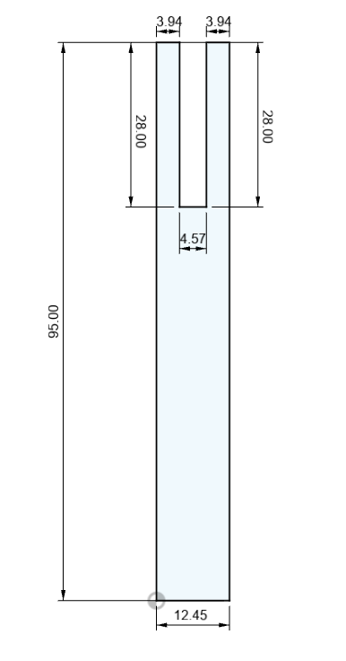
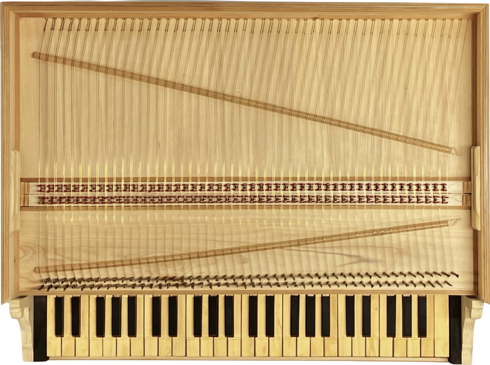

# Harpischord Model Data

Measurements and 3D models related to Haptic Harpsichord project

- [Harpischord Model Data](#harpischord-model-data)
  - [Jack Info](#jack-info)
    - [Dimensions](#dimensions)
      - [Tongue](#tongue)
      - [Quill](#quill)
      - [Damper](#damper)
    - [Spacings](#spacings)
    - [Gradient Surface](#gradient-surface)
  - [Full Scale Keyboard](#full-scale-keyboard)
    - [Jack](#jack)
      - [Dimensions](#dimensions-1)
      - [Jack Pitch](#jack-pitch)
      - [Travel](#travel)
  - [QRE1113 Notes](#qre1113-notes)
  - [Paper Structure](#paper-structure)
  - [Paper Ideas](#paper-ideas)
  - [Model](#model)


## Jack Info




### Dimensions

```
height:   93.00mm
depth :   12.35mm
width :    4.60mm

Movement: ~8.00mm
```

#### Tongue

```
HeightF: 29.50mm
HeightB: 28.00mm 
Depth  :  4.58mm
Width  :  3.04mm  10.
```
#### Quill

```
height: 2.30mm
width : 0.70mm
depth : 9.22mm
```


#### Damper

```
slot:        1.00mm
width(max) : 10.00mm
height(max): 10.00mm
```

### Spacings

```
soundboard to jack lip:    5.0mm
Jack Pitch:               15.0mm
Block Depth:              74.0mm
Depth to first Jack:     ~63.4mm
Depth to 1st Jack Centre:~65.7mm
Jack 1:                    8.4mm
Jack 2:                   23.4mm
Jack 3:                   38.4mm
Header Pins
Board Dim: 85mm x 18mm

```

- Distance from back jacks to the centre block separating keys and cavity:   18.00mm
- Space from the support strut for the jack block to the backplane: 51.00mm
  - height of that are 14.00mm
  - reducing to 10.00mm under strut
- base of jack to start of slot (i.e. how much sticker is exposed): 21.00mm

### Gradient Surface

```
width:    4.6mm
height:  20.0mm
```

## Full Scale Keyboard 

|        |
| :-----------------------------: |
| Top view of the 49-key keyboard |

The full scale version of the interface has 49 keys and 2 jack rows. The jacks are generally around `4.65 mm`.

### Jack 

#### Dimensions

```
height:   93.50mm
depth:    13.05mm
Movement: ~8.00mm
Width:     4.70mm
```


#### Jack Pitch

There is not much variation in the pitch of the jacks. On average the centre-to-centre is `14.02 mm`. Likely error between jacks would compound across the full length. This should be compensated for by the separate pcbs which have groups of 7 sensors.

Space between the jacks is `9.75 mm`, meaning central pcbs will have to have less than half this distance (`4.875mm`) in order to slot together.

#### Travel

Front jacks have a travel of about `8.5mm` and back jacks `9.0mm` between key release and full key press.

## QRE1113 Notes

Sweet spot is around 6mm distance


[Datasheet](https://www.mouser.in/datasheet/2/308/QRE1113-1121523.pdf)


## Paper Structure

- Intro: aims and constraints
  - track jacks of a harpsichord for interacting with digital instrument
- Current work done and extraction from those
  - TODO: Find example papers
      - inspiration taken
      - concepts developed
- What happened / what was done
  - algorithm
  - calibration
- Measure success of  what was done
- What happens next?


## Paper Ideas

- Jack tracking of harpsichord
- effects of mechanical noise
- player  interaction experience with and without haptics


## Model

```stl
solid ASCII
  facet normal 2.829449e-13 9.914449e-01 1.305262e-01
    outer loop
      vertex   8.450000e+00 3.453296e+01 3.994095e-01
      vertex   8.475000e+00 3.453296e+01 3.994095e-01
      vertex   8.450000e+00 3.455000e+01 2.700000e-01
    endloop
  endfacet
  facet normal 9.245461e-14 9.914449e-01 1.305262e-01
    outer loop
      vertex   8.450000e+00 3.455000e+01 2.700000e-01
      vertex   8.475000e+00 3.453296e+01 3.994095e-01
      vertex   8.475000e+00 3.455000e+01 2.700000e-01
    endloop
  endfacet
  facet normal -9.245461e-14 9.914449e-01 -1.305262e-01
    outer loop
      vertex   8.450000e+00 3.455000e+01 2.700000e-01
      vertex   8.475000e+00 3.455000e+01 2.700000e-01
      vertex   8.450000e+00 3.453296e+01 1.405905e-01
    endloop
  endfacet
  facet normal 2.806263e-13 9.914449e-01 -1.305262e-01
    outer loop
      vertex   8.450000e+00 3.453296e+01 1.405905e-01
      vertex   8.475000e+00 3.455000e+01 2.700000e-01
      vertex   8.475000e+00 3.453296e+01 1.405905e-01
    endloop
  endfacet
  facet normal 2.591834e-13 9.238795e-01 -3.826834e-01
    outer loop
      vertex   8.450000e+00 3.453296e+01 1.405905e-01
      vertex   8.475000e+00 3.453296e+01 1.405905e-01
      vertex   8.450000e+00 3.448301e+01 2.000000e-02
    endloop
  endfacet
  facet normal 2.593959e-13 9.238795e-01 -3.826834e-01
    outer loop
      vertex   8.450000e+00 3.448301e+01 2.000000e-02
      vertex   8.475000e+00 3.453296e+01 1.405905e-01
      vertex   8.475000e+00 3.448301e+01 2.000000e-02
    endloop
  endfacet
  facet normal 2.204156e-13 7.933533e-01 -6.087614e-01
    outer loop
      vertex   8.450000e+00 3.448301e+01 2.000000e-02
      vertex   8.475000e+00 3.448301e+01 2.000000e-02
      vertex   8.450000e+00 3.440355e+01 -8.355339e-02
    endloop
  endfacet
  facet normal 0.000000e+00 7.933533e-01 -6.087614e-01
    outer loop
      vertex   8.450000e+00 3.440355e+01 -8.355339e-02
      vertex   8.475000e+00 3.448301e+01 2.000000e-02
      vertex   8.475000e+00 3.440355e+01 -8.355339e-02
    endloop
  endfacet
  facet normal 0.000000e+00 6.087614e-01 -7.933533e-01
    outer loop
      vertex   8.450000e+00 3.440355e+01 -8.355339e-02
      vertex   8.475000e+00 3.440355e+01 -8.355339e-02
      vertex   8.450000e+00 3.430000e+01 -1.630127e-01
    endloop
  endfacet
  facet normal 1.642124e-13 6.087614e-01 -7.933533e-01
    outer loop
      vertex   8.450000e+00 3.430000e+01 -1.630127e-01
      vertex   8.475000e+00 3.440355e+01 -8.355339e-02
      vertex   8.475000e+00 3.430000e+01 -1.630127e-01
    endloop
  endfacet
  facet normal 9.850805e-14 3.826834e-01 -9.238795e-01
    outer loop
      vertex   8.450000e+00 3.430000e+01 -1.630127e-01
      vertex   8.475000e+00 3.430000e+01 -1.630127e-01
      vertex   8.450000e+00 3.417941e+01 -2.129629e-01
    endloop
  endfacet
  facet normal 0.000000e+00 3.826834e-01 -9.238795e-01
    outer loop
      vertex   8.450000e+00 3.417941e+01 -2.129629e-01
      vertex   8.475000e+00 3.430000e+01 -1.630127e-01
      vertex   8.475000e+00 3.417941e+01 -2.129629e-01
    endloop
  endfacet
  facet normal 0.000000e+00 1.305262e-01 -9.914449e-01
    outer loop
      vertex   8.450000e+00 3.417941e+01 -2.129629e-01
      vertex   8.475000e+00 3.417941e+01 -2.129629e-01
      vertex   8.450000e+00 3.405000e+01 -2.300000e-01
    endloop
  endfacet
  facet normal 3.709778e-14 1.305262e-01 -9.914449e-01
    outer loop
      vertex   8.450000e+00 3.405000e+01 -2.300000e-01
      vertex   8.475000e+00 3.417941e+01 -2.129629e-01
      vertex   8.475000e+00 3.405000e+01 -2.300000e-01
    endloop
  endfacet
  facet normal -3.709778e-14 -1.305262e-01 -9.914449e-01
    outer loop
      vertex   8.450000e+00 3.405000e+01 -2.300000e-01
      vertex   8.475000e+00 3.405000e+01 -2.300000e-01
      vertex   8.450000e+00 3.392059e+01 -2.129629e-01
    endloop
  endfacet
  facet normal -3.159415e-14 -1.305262e-01 -9.914449e-01
    outer loop
      vertex   8.450000e+00 3.392059e+01 -2.129629e-01
      vertex   8.475000e+00 3.405000e+01 -2.300000e-01
      vertex   8.475000e+00 3.392059e+01 -2.129629e-01
    endloop
  endfacet
  facet normal -1.036366e-13 -3.826834e-01 -9.238795e-01
    outer loop
      vertex   8.450000e+00 3.392059e+01 -2.129629e-01
      vertex   8.475000e+00 3.392059e+01 -2.129629e-01
      vertex   8.450000e+00 3.380000e+01 -1.630127e-01
    endloop
  endfacet
  facet normal -1.067137e-13 -3.826834e-01 -9.238795e-01
    outer loop
      vertex   8.450000e+00 3.380000e+01 -1.630127e-01
      vertex   8.475000e+00 3.392059e+01 -2.129629e-01
      vertex   8.475000e+00 3.380000e+01 -1.630127e-01
    endloop
  endfacet
  facet normal -1.712588e-13 -6.087614e-01 -7.933533e-01
    outer loop
      vertex   8.450000e+00 3.380000e+01 -1.630127e-01
      vertex   8.475000e+00 3.380000e+01 -1.630127e-01
      vertex   8.450000e+00 3.369645e+01 -8.355339e-02
    endloop
  endfacet
  facet normal 2.201998e-15 -6.087614e-01 -7.933533e-01
    outer loop
      vertex   8.450000e+00 3.369645e+01 -8.355339e-02
      vertex   8.475000e+00 3.380000e+01 -1.630127e-01
      vertex   8.475000e+00 3.369645e+01 -8.355339e-02
    endloop
  endfacet
  facet normal 1.689652e-15 -7.933533e-01 -6.087614e-01
    outer loop
      vertex   8.450000e+00 3.369645e+01 -8.355339e-02
      vertex   8.475000e+00 3.369645e+01 -8.355339e-02
      vertex   8.450000e+00 3.361699e+01 2.000000e-02
    endloop
  endfacet
  facet normal -2.212605e-13 -7.933533e-01 -6.087614e-01
    outer loop
      vertex   8.450000e+00 3.361699e+01 2.000000e-02
      vertex   8.475000e+00 3.369645e+01 -8.355339e-02
      vertex   8.475000e+00 3.361699e+01 2.000000e-02
    endloop
  endfacet
  facet normal -2.599270e-13 -9.238795e-01 -3.826834e-01
    outer loop
      vertex   8.450000e+00 3.361699e+01 2.000000e-02
      vertex   8.475000e+00 3.361699e+01 2.000000e-02
      vertex   8.450000e+00 3.356704e+01 1.405905e-01
    endloop
  endfacet
  facet normal 3.398912e-15 -9.238795e-01 -3.826834e-01
    outer loop
      vertex   8.450000e+00 3.356704e+01 1.405905e-01
      vertex   8.475000e+00 3.361699e+01 2.000000e-02
      vertex   8.475000e+00 3.356704e+01 1.405905e-01
    endloop
  endfacet
  facet normal 1.159305e-15 -9.914449e-01 -1.305262e-01
    outer loop
      vertex   8.450000e+00 3.356704e+01 1.405905e-01
      vertex   8.475000e+00 3.356704e+01 1.405905e-01
      vertex   8.450000e+00 3.355000e+01 2.700000e-01
    endloop
  endfacet
  facet normal 0.000000e+00 -9.914449e-01 -1.305262e-01
    outer loop
      vertex   8.450000e+00 3.355000e+01 2.700000e-01
      vertex   8.475000e+00 3.356704e+01 1.405905e-01
      vertex   8.475000e+00 3.355000e+01 2.700000e-01
    endloop
  endfacet
  facet normal 0.000000e+00 -9.914449e-01 1.305262e-01
    outer loop
      vertex   8.450000e+00 3.355000e+01 2.700000e-01
      vertex   8.475000e+00 3.355000e+01 2.700000e-01
      vertex   8.450000e+00 3.356704e+01 3.994095e-01
    endloop
  endfacet
  facet normal -8.694791e-16 -9.914449e-01 1.305262e-01
    outer loop
      vertex   8.450000e+00 3.356704e+01 3.994095e-01
      vertex   8.475000e+00 3.355000e+01 2.700000e-01
      vertex   8.475000e+00 3.356704e+01 3.994095e-01
    endloop
  endfacet
  facet normal -2.549184e-15 -9.238795e-01 3.826834e-01
    outer loop
      vertex   8.450000e+00 3.356704e+01 3.994095e-01
      vertex   8.475000e+00 3.356704e+01 3.994095e-01
      vertex   8.450000e+00 3.361699e+01 5.200000e-01
    endloop
  endfacet
  facet normal -2.659813e-13 -9.238795e-01 3.826834e-01
    outer loop
      vertex   8.450000e+00 3.361699e+01 5.200000e-01
      vertex   8.475000e+00 3.356704e+01 3.994095e-01
      vertex   8.475000e+00 3.361699e+01 5.200000e-01
    endloop
  endfacet
  facet normal -2.308915e-13 -7.933533e-01 6.087614e-01
    outer loop
      vertex   8.450000e+00 3.361699e+01 5.200000e-01
      vertex   8.475000e+00 3.361699e+01 5.200000e-01
      vertex   8.450000e+00 3.369645e+01 6.235534e-01
    endloop
  endfacet
  facet normal 0.000000e+00 -7.933533e-01 6.087614e-01
    outer loop
      vertex   8.450000e+00 3.369645e+01 6.235534e-01
      vertex   8.475000e+00 3.361699e+01 5.200000e-01
      vertex   8.475000e+00 3.369645e+01 6.235534e-01
    endloop
  endfacet
  facet normal 0.000000e+00 -6.087614e-01 7.933533e-01
    outer loop
      vertex   8.450000e+00 3.369645e+01 6.235534e-01
      vertex   8.475000e+00 3.369645e+01 6.235534e-01
      vertex   8.450000e+00 3.380000e+01 7.030127e-01
    endloop
  endfacet
  facet normal -1.730204e-13 -6.087614e-01 7.933533e-01
    outer loop
      vertex   8.450000e+00 3.380000e+01 7.030127e-01
      vertex   8.475000e+00 3.369645e+01 6.235534e-01
      vertex   8.475000e+00 3.380000e+01 7.030127e-01
    endloop
  endfacet
  facet normal -1.087652e-13 -3.826834e-01 9.238795e-01
    outer loop
      vertex   8.450000e+00 3.380000e+01 7.030127e-01
      vertex   8.475000e+00 3.380000e+01 7.030127e-01
      vertex   8.450000e+00 3.392059e+01 7.529629e-01
    endloop
  endfacet
  facet normal -1.128680e-13 -3.826834e-01 9.238795e-01
    outer loop
      vertex   8.450000e+00 3.392059e+01 7.529629e-01
      vertex   8.475000e+00 3.380000e+01 7.030127e-01
      vertex   8.475000e+00 3.392059e+01 7.529629e-01
    endloop
  endfacet
  facet normal -4.150067e-14 -1.305262e-01 9.914449e-01
    outer loop
      vertex   8.450000e+00 3.392059e+01 7.529629e-01
      vertex   8.475000e+00 3.392059e+01 7.529629e-01
      vertex   8.450000e+00 3.405000e+01 7.700000e-01
    endloop
  endfacet
  facet normal -3.709778e-14 -1.305262e-01 9.914449e-01
    outer loop
      vertex   8.450000e+00 3.405000e+01 7.700000e-01
      vertex   8.475000e+00 3.392059e+01 7.529629e-01
      vertex   8.475000e+00 3.405000e+01 7.700000e-01
    endloop
  endfacet
  facet normal 3.709778e-14 1.305262e-01 9.914449e-01
    outer loop
      vertex   8.450000e+00 3.405000e+01 7.700000e-01
      vertex   8.475000e+00 3.405000e+01 7.700000e-01
      vertex   8.450000e+00 3.417941e+01 7.529629e-01
    endloop
  endfacet
  facet normal -0.000000e+00 1.305262e-01 9.914449e-01
    outer loop
      vertex   8.450000e+00 3.417941e+01 7.529629e-01
      vertex   8.475000e+00 3.405000e+01 7.700000e-01
      vertex   8.475000e+00 3.417941e+01 7.529629e-01
    endloop
  endfacet
  facet normal -0.000000e+00 3.826834e-01 9.238795e-01
    outer loop
      vertex   8.450000e+00 3.417941e+01 7.529629e-01
      vertex   8.475000e+00 3.417941e+01 7.529629e-01
      vertex   8.450000e+00 3.430000e+01 7.030127e-01
    endloop
  endfacet
  facet normal 1.169709e-13 3.826834e-01 9.238795e-01
    outer loop
      vertex   8.450000e+00 3.430000e+01 7.030127e-01
      vertex   8.475000e+00 3.417941e+01 7.529629e-01
      vertex   8.475000e+00 3.430000e+01 7.030127e-01
    endloop
  endfacet
  facet normal 1.800668e-13 6.087614e-01 7.933533e-01
    outer loop
      vertex   8.450000e+00 3.430000e+01 7.030127e-01
      vertex   8.475000e+00 3.430000e+01 7.030127e-01
      vertex   8.450000e+00 3.440355e+01 6.235534e-01
    endloop
  endfacet
  facet normal -0.000000e+00 6.087614e-01 7.933533e-01
    outer loop
      vertex   8.450000e+00 3.440355e+01 6.235534e-01
      vertex   8.475000e+00 3.430000e+01 7.030127e-01
      vertex   8.475000e+00 3.440355e+01 6.235534e-01
    endloop
  endfacet
  facet normal -0.000000e+00 7.933533e-01 6.087614e-01
    outer loop
      vertex   8.450000e+00 3.440355e+01 6.235534e-01
      vertex   8.475000e+00 3.440355e+01 6.235534e-01
      vertex   8.450000e+00 3.448301e+01 5.200000e-01
    endloop
  endfacet
  facet normal 2.281880e-13 7.933533e-01 6.087614e-01
    outer loop
      vertex   8.450000e+00 3.448301e+01 5.200000e-01
      vertex   8.475000e+00 3.440355e+01 6.235534e-01
      vertex   8.475000e+00 3.448301e+01 5.200000e-01
    endloop
  endfacet
  facet normal 2.642818e-13 9.238795e-01 3.826834e-01
    outer loop
      vertex   8.450000e+00 3.448301e+01 5.200000e-01
      vertex   8.475000e+00 3.448301e+01 5.200000e-01
      vertex   8.450000e+00 3.453296e+01 3.994095e-01
    endloop
  endfacet
  facet normal 2.659813e-13 9.238795e-01 3.826834e-01
    outer loop
      vertex   8.450000e+00 3.453296e+01 3.994095e-01
      vertex   8.475000e+00 3.448301e+01 5.200000e-01
      vertex   8.475000e+00 3.453296e+01 3.994095e-01
    endloop
  endfacet
  facet normal 2.229434e-16 9.914449e-01 1.305262e-01
    outer loop
      vertex   4.380000e+00 3.453296e+01 3.994095e-01
      vertex   4.510000e+00 3.453296e+01 3.994095e-01
      vertex   4.380000e+00 3.455000e+01 2.700000e-01
    endloop
  endfacet
  facet normal -1.114717e-16 9.914449e-01 1.305262e-01
    outer loop
      vertex   4.380000e+00 3.455000e+01 2.700000e-01
      vertex   4.510000e+00 3.453296e+01 3.994095e-01
      vertex   4.510000e+00 3.455000e+01 2.700000e-01
    endloop
  endfacet
  facet normal 1.114717e-16 9.914449e-01 -1.305262e-01
    outer loop
      vertex   4.380000e+00 3.455000e+01 2.700000e-01
      vertex   4.510000e+00 3.455000e+01 2.700000e-01
      vertex   4.380000e+00 3.453296e+01 1.405905e-01
    endloop
  endfacet
  facet normal -2.229434e-16 9.914449e-01 -1.305262e-01
    outer loop
      vertex   4.380000e+00 3.453296e+01 1.405905e-01
      vertex   4.510000e+00 3.455000e+01 2.700000e-01
      vertex   4.510000e+00 3.453296e+01 1.405905e-01
    endloop
  endfacet
  facet normal -6.536369e-16 9.238795e-01 -3.826834e-01
    outer loop
      vertex   4.380000e+00 3.453296e+01 1.405905e-01
      vertex   4.510000e+00 3.453296e+01 1.405905e-01
      vertex   4.380000e+00 3.448301e+01 2.000000e-02
    endloop
  endfacet
  facet normal -6.127846e-16 9.238795e-01 -3.826834e-01
    outer loop
      vertex   4.380000e+00 3.448301e+01 2.000000e-02
      vertex   4.510000e+00 3.453296e+01 1.405905e-01
      vertex   4.510000e+00 3.448301e+01 2.000000e-02
    endloop
  endfacet
  facet normal -9.747995e-16 7.933533e-01 -6.087614e-01
    outer loop
      vertex   4.380000e+00 3.448301e+01 2.000000e-02
      vertex   4.510000e+00 3.448301e+01 2.000000e-02
      vertex   4.380000e+00 3.440355e+01 -8.355339e-02
    endloop
  endfacet
  facet normal 0.000000e+00 7.933533e-01 -6.087614e-01
    outer loop
      vertex   4.380000e+00 3.440355e+01 -8.355339e-02
      vertex   4.510000e+00 3.448301e+01 2.000000e-02
      vertex   4.510000e+00 3.440355e+01 -8.355339e-02
    endloop
  endfacet
  facet normal 0.000000e+00 6.087614e-01 -7.933533e-01
    outer loop
      vertex   4.380000e+00 3.440355e+01 -8.355339e-02
      vertex   4.510000e+00 3.440355e+01 -8.355339e-02
      vertex   4.380000e+00 3.430000e+01 -1.630127e-01
    endloop
  endfacet
  facet normal -1.693845e-15 6.087614e-01 -7.933533e-01
    outer loop
      vertex   4.380000e+00 3.430000e+01 -1.630127e-01
      vertex   4.510000e+00 3.440355e+01 -8.355339e-02
      vertex   4.510000e+00 3.430000e+01 -1.630127e-01
    endloop
  endfacet
  facet normal -1.972524e-15 3.826834e-01 -9.238795e-01
    outer loop
      vertex   4.380000e+00 3.430000e+01 -1.630127e-01
      vertex   4.510000e+00 3.430000e+01 -1.630127e-01
      vertex   4.380000e+00 3.417941e+01 -2.129629e-01
    endloop
  endfacet
  facet normal 0.000000e+00 3.826834e-01 -9.238795e-01
    outer loop
      vertex   4.380000e+00 3.417941e+01 -2.129629e-01
      vertex   4.510000e+00 3.430000e+01 -1.630127e-01
      vertex   4.510000e+00 3.417941e+01 -2.129629e-01
    endloop
  endfacet
  facet normal 0.000000e+00 1.305262e-01 -9.914449e-01
    outer loop
      vertex   4.380000e+00 3.417941e+01 -2.129629e-01
      vertex   4.510000e+00 3.417941e+01 -2.129629e-01
      vertex   4.380000e+00 3.405000e+01 -2.300000e-01
    endloop
  endfacet
  facet normal 0.000000e+00 1.305262e-01 -9.914449e-01
    outer loop
      vertex   4.380000e+00 3.405000e+01 -2.300000e-01
      vertex   4.510000e+00 3.417941e+01 -2.129629e-01
      vertex   4.510000e+00 3.405000e+01 -2.300000e-01
    endloop
  endfacet
  facet normal 0.000000e+00 -1.305262e-01 -9.914449e-01
    outer loop
      vertex   4.380000e+00 3.405000e+01 -2.300000e-01
      vertex   4.510000e+00 3.405000e+01 -2.300000e-01
      vertex   4.380000e+00 3.392059e+01 -2.129629e-01
    endloop
  endfacet
  facet normal 1.058389e-15 -1.305262e-01 -9.914449e-01
    outer loop
      vertex   4.380000e+00 3.392059e+01 -2.129629e-01
      vertex   4.510000e+00 3.405000e+01 -2.300000e-01
      vertex   4.510000e+00 3.392059e+01 -2.129629e-01
    endloop
  endfacet
  facet normal 9.862619e-16 -3.826834e-01 -9.238795e-01
    outer loop
      vertex   4.380000e+00 3.392059e+01 -2.129629e-01
      vertex   4.510000e+00 3.392059e+01 -2.129629e-01
      vertex   4.380000e+00 3.380000e+01 -1.630127e-01
    endloop
  endfacet
  facet normal 3.945047e-16 -3.826834e-01 -9.238795e-01
    outer loop
      vertex   4.380000e+00 3.380000e+01 -1.630127e-01
      vertex   4.510000e+00 3.392059e+01 -2.129629e-01
      vertex   4.510000e+00 3.380000e+01 -1.630127e-01
    endloop
  endfacet
  facet normal 3.387689e-16 -6.087614e-01 -7.933533e-01
    outer loop
      vertex   4.380000e+00 3.380000e+01 -1.630127e-01
      vertex   4.510000e+00 3.380000e+01 -1.630127e-01
      vertex   4.380000e+00 3.369645e+01 -8.355339e-02
    endloop
  endfacet
  facet normal 4.234611e-16 -6.087614e-01 -7.933533e-01
    outer loop
      vertex   4.380000e+00 3.369645e+01 -8.355339e-02
      vertex   4.510000e+00 3.380000e+01 -1.630127e-01
      vertex   4.510000e+00 3.369645e+01 -8.355339e-02
    endloop
  endfacet
  facet normal 3.249332e-16 -7.933533e-01 -6.087614e-01
    outer loop
      vertex   4.380000e+00 3.369645e+01 -8.355339e-02
      vertex   4.510000e+00 3.369645e+01 -8.355339e-02
      vertex   4.380000e+00 3.361699e+01 2.000000e-02
    endloop
  endfacet
  facet normal 8.123329e-16 -7.933533e-01 -6.087614e-01
    outer loop
      vertex   4.380000e+00 3.361699e+01 2.000000e-02
      vertex   4.510000e+00 3.369645e+01 -8.355339e-02
      vertex   4.510000e+00 3.361699e+01 2.000000e-02
    endloop
  endfacet
  facet normal 5.106538e-16 -9.238795e-01 -3.826834e-01
    outer loop
      vertex   4.380000e+00 3.361699e+01 2.000000e-02
      vertex   4.510000e+00 3.361699e+01 2.000000e-02
      vertex   4.380000e+00 3.356704e+01 1.405905e-01
    endloop
  endfacet
  facet normal 6.536369e-16 -9.238795e-01 -3.826834e-01
    outer loop
      vertex   4.380000e+00 3.356704e+01 1.405905e-01
      vertex   4.510000e+00 3.361699e+01 2.000000e-02
      vertex   4.510000e+00 3.356704e+01 1.405905e-01
    endloop
  endfacet
  facet normal 2.229434e-16 -9.914449e-01 -1.305262e-01
    outer loop
      vertex   4.380000e+00 3.356704e+01 1.405905e-01
      vertex   4.510000e+00 3.356704e+01 1.405905e-01
      vertex   4.380000e+00 3.355000e+01 2.700000e-01
    endloop
  endfacet
  facet normal 0.000000e+00 -9.914449e-01 -1.305262e-01
    outer loop
      vertex   4.380000e+00 3.355000e+01 2.700000e-01
      vertex   4.510000e+00 3.356704e+01 1.405905e-01
      vertex   4.510000e+00 3.355000e+01 2.700000e-01
    endloop
  endfacet
  facet normal 0.000000e+00 -9.914449e-01 1.305262e-01
    outer loop
      vertex   4.380000e+00 3.355000e+01 2.700000e-01
      vertex   4.510000e+00 3.355000e+01 2.700000e-01
      vertex   4.380000e+00 3.356704e+01 3.994095e-01
    endloop
  endfacet
  facet normal -1.672075e-16 -9.914449e-01 1.305262e-01
    outer loop
      vertex   4.380000e+00 3.356704e+01 3.994095e-01
      vertex   4.510000e+00 3.355000e+01 2.700000e-01
      vertex   4.510000e+00 3.356704e+01 3.994095e-01
    endloop
  endfacet
  facet normal -4.902276e-16 -9.238795e-01 3.826834e-01
    outer loop
      vertex   4.380000e+00 3.356704e+01 3.994095e-01
      vertex   4.510000e+00 3.356704e+01 3.994095e-01
      vertex   4.380000e+00 3.361699e+01 5.200000e-01
    endloop
  endfacet
  facet normal -6.536369e-16 -9.238795e-01 3.826834e-01
    outer loop
      vertex   4.380000e+00 3.361699e+01 5.200000e-01
      vertex   4.510000e+00 3.356704e+01 3.994095e-01
      vertex   4.510000e+00 3.361699e+01 5.200000e-01
    endloop
  endfacet
  facet normal -1.039786e-15 -7.933533e-01 6.087614e-01
    outer loop
      vertex   4.380000e+00 3.361699e+01 5.200000e-01
      vertex   4.510000e+00 3.361699e+01 5.200000e-01
      vertex   4.380000e+00 3.369645e+01 6.235534e-01
    endloop
  endfacet
  facet normal 0.000000e+00 -7.933533e-01 6.087614e-01
    outer loop
      vertex   4.380000e+00 3.369645e+01 6.235534e-01
      vertex   4.510000e+00 3.361699e+01 5.200000e-01
      vertex   4.510000e+00 3.369645e+01 6.235534e-01
    endloop
  endfacet
  facet normal 0.000000e+00 -6.087614e-01 7.933533e-01
    outer loop
      vertex   4.380000e+00 3.369645e+01 6.235534e-01
      vertex   4.510000e+00 3.369645e+01 6.235534e-01
      vertex   4.380000e+00 3.380000e+01 7.030127e-01
    endloop
  endfacet
  facet normal 0.000000e+00 -6.087614e-01 7.933533e-01
    outer loop
      vertex   4.380000e+00 3.380000e+01 7.030127e-01
      vertex   4.510000e+00 3.369645e+01 6.235534e-01
      vertex   4.510000e+00 3.380000e+01 7.030127e-01
    endloop
  endfacet
  facet normal 0.000000e+00 -3.826834e-01 9.238795e-01
    outer loop
      vertex   4.380000e+00 3.380000e+01 7.030127e-01
      vertex   4.510000e+00 3.380000e+01 7.030127e-01
      vertex   4.380000e+00 3.392059e+01 7.529629e-01
    endloop
  endfacet
  facet normal -7.890095e-16 -3.826834e-01 9.238795e-01
    outer loop
      vertex   4.380000e+00 3.392059e+01 7.529629e-01
      vertex   4.510000e+00 3.380000e+01 7.030127e-01
      vertex   4.510000e+00 3.392059e+01 7.529629e-01
    endloop
  endfacet
  facet normal -8.467115e-16 -1.305262e-01 9.914449e-01
    outer loop
      vertex   4.380000e+00 3.392059e+01 7.529629e-01
      vertex   4.510000e+00 3.392059e+01 7.529629e-01
      vertex   4.380000e+00 3.405000e+01 7.700000e-01
    endloop
  endfacet
  facet normal 0.000000e+00 -1.305262e-01 9.914449e-01
    outer loop
      vertex   4.380000e+00 3.405000e+01 7.700000e-01
      vertex   4.510000e+00 3.392059e+01 7.529629e-01
      vertex   4.510000e+00 3.405000e+01 7.700000e-01
    endloop
  endfacet
  facet normal -0.000000e+00 1.305262e-01 9.914449e-01
    outer loop
      vertex   4.380000e+00 3.405000e+01 7.700000e-01
      vertex   4.510000e+00 3.405000e+01 7.700000e-01
      vertex   4.380000e+00 3.417941e+01 7.529629e-01
    endloop
  endfacet
  facet normal -0.000000e+00 1.305262e-01 9.914449e-01
    outer loop
      vertex   4.380000e+00 3.417941e+01 7.529629e-01
      vertex   4.510000e+00 3.405000e+01 7.700000e-01
      vertex   4.510000e+00 3.417941e+01 7.529629e-01
    endloop
  endfacet
  facet normal -0.000000e+00 3.826834e-01 9.238795e-01
    outer loop
      vertex   4.380000e+00 3.417941e+01 7.529629e-01
      vertex   4.510000e+00 3.417941e+01 7.529629e-01
      vertex   4.380000e+00 3.430000e+01 7.030127e-01
    endloop
  endfacet
  facet normal 1.578019e-15 3.826834e-01 9.238795e-01
    outer loop
      vertex   4.380000e+00 3.430000e+01 7.030127e-01
      vertex   4.510000e+00 3.417941e+01 7.529629e-01
      vertex   4.510000e+00 3.430000e+01 7.030127e-01
    endloop
  endfacet
  facet normal 1.355076e-15 6.087614e-01 7.933533e-01
    outer loop
      vertex   4.380000e+00 3.430000e+01 7.030127e-01
      vertex   4.510000e+00 3.430000e+01 7.030127e-01
      vertex   4.380000e+00 3.440355e+01 6.235534e-01
    endloop
  endfacet
  facet normal -0.000000e+00 6.087614e-01 7.933533e-01
    outer loop
      vertex   4.380000e+00 3.440355e+01 6.235534e-01
      vertex   4.510000e+00 3.430000e+01 7.030127e-01
      vertex   4.510000e+00 3.440355e+01 6.235534e-01
    endloop
  endfacet
  facet normal -0.000000e+00 7.933533e-01 6.087614e-01
    outer loop
      vertex   4.380000e+00 3.440355e+01 6.235534e-01
      vertex   4.510000e+00 3.440355e+01 6.235534e-01
      vertex   4.380000e+00 3.448301e+01 5.200000e-01
    endloop
  endfacet
  facet normal 5.198930e-16 7.933533e-01 6.087614e-01
    outer loop
      vertex   4.380000e+00 3.448301e+01 5.200000e-01
      vertex   4.510000e+00 3.440355e+01 6.235534e-01
      vertex   4.510000e+00 3.448301e+01 5.200000e-01
    endloop
  endfacet
  facet normal 3.268184e-16 9.238795e-01 3.826834e-01
    outer loop
      vertex   4.380000e+00 3.448301e+01 5.200000e-01
      vertex   4.510000e+00 3.448301e+01 5.200000e-01
      vertex   4.380000e+00 3.453296e+01 3.994095e-01
    endloop
  endfacet
  facet normal 6.536369e-16 9.238795e-01 3.826834e-01
    outer loop
      vertex   4.380000e+00 3.453296e+01 3.994095e-01
      vertex   4.510000e+00 3.448301e+01 5.200000e-01
      vertex   4.510000e+00 3.453296e+01 3.994095e-01
    endloop
  endfacet
  facet normal -1.811415e-16 9.914449e-01 -1.305262e-01
    outer loop
      vertex   1.000000e-01 3.453296e+01 1.405905e-01
      vertex   -6.000000e-02 3.453296e+01 1.405905e-01
      vertex   1.000000e-01 3.455000e+01 2.700000e-01
    endloop
  endfacet
  facet normal 9.057074e-17 9.914449e-01 -1.305262e-01
    outer loop
      vertex   1.000000e-01 3.455000e+01 2.700000e-01
      vertex   -6.000000e-02 3.453296e+01 1.405905e-01
      vertex   -6.000000e-02 3.455000e+01 2.700000e-01
    endloop
  endfacet
  facet normal -9.057074e-17 9.914449e-01 1.305262e-01
    outer loop
      vertex   1.000000e-01 3.455000e+01 2.700000e-01
      vertex   -6.000000e-02 3.455000e+01 2.700000e-01
      vertex   1.000000e-01 3.453296e+01 3.994095e-01
    endloop
  endfacet
  facet normal 1.811415e-16 9.914449e-01 1.305262e-01
    outer loop
      vertex   1.000000e-01 3.453296e+01 3.994095e-01
      vertex   -6.000000e-02 3.455000e+01 2.700000e-01
      vertex   -6.000000e-02 3.453296e+01 3.994095e-01
    endloop
  endfacet
  facet normal 5.310799e-16 9.238795e-01 3.826834e-01
    outer loop
      vertex   1.000000e-01 3.453296e+01 3.994095e-01
      vertex   -6.000000e-02 3.453296e+01 3.994095e-01
      vertex   1.000000e-01 3.448301e+01 5.200000e-01
    endloop
  endfacet
  facet normal 2.655400e-16 9.238795e-01 3.826834e-01
    outer loop
      vertex   1.000000e-01 3.448301e+01 5.200000e-01
      vertex   -6.000000e-02 3.453296e+01 3.994095e-01
      vertex   -6.000000e-02 3.448301e+01 5.200000e-01
    endloop
  endfacet
  facet normal 4.224131e-16 7.933533e-01 6.087614e-01
    outer loop
      vertex   1.000000e-01 3.448301e+01 5.200000e-01
      vertex   -6.000000e-02 3.448301e+01 5.200000e-01
      vertex   1.000000e-01 3.440355e+01 6.235534e-01
    endloop
  endfacet
  facet normal 0.000000e+00 7.933533e-01 6.087614e-01
    outer loop
      vertex   1.000000e-01 3.440355e+01 6.235534e-01
      vertex   -6.000000e-02 3.448301e+01 5.200000e-01
      vertex   -6.000000e-02 3.440355e+01 6.235534e-01
    endloop
  endfacet
  facet normal 0.000000e+00 6.087614e-01 7.933533e-01
    outer loop
      vertex   1.000000e-01 3.440355e+01 6.235534e-01
      vertex   -6.000000e-02 3.440355e+01 6.235534e-01
      vertex   1.000000e-01 3.430000e+01 7.030127e-01
    endloop
  endfacet
  facet normal 1.100999e-15 6.087614e-01 7.933533e-01
    outer loop
      vertex   1.000000e-01 3.430000e+01 7.030127e-01
      vertex   -6.000000e-02 3.440355e+01 6.235534e-01
      vertex   -6.000000e-02 3.430000e+01 7.030127e-01
    endloop
  endfacet
  facet normal 1.282140e-15 3.826834e-01 9.238795e-01
    outer loop
      vertex   1.000000e-01 3.430000e+01 7.030127e-01
      vertex   -6.000000e-02 3.430000e+01 7.030127e-01
      vertex   1.000000e-01 3.417941e+01 7.529629e-01
    endloop
  endfacet
  facet normal 0.000000e+00 3.826834e-01 9.238795e-01
    outer loop
      vertex   1.000000e-01 3.417941e+01 7.529629e-01
      vertex   -6.000000e-02 3.430000e+01 7.030127e-01
      vertex   -6.000000e-02 3.417941e+01 7.529629e-01
    endloop
  endfacet
  facet normal 0.000000e+00 1.305262e-01 9.914449e-01
    outer loop
      vertex   1.000000e-01 3.417941e+01 7.529629e-01
      vertex   -6.000000e-02 3.417941e+01 7.529629e-01
      vertex   1.000000e-01 3.405000e+01 7.700000e-01
    endloop
  endfacet
  facet normal 0.000000e+00 1.305262e-01 9.914449e-01
    outer loop
      vertex   1.000000e-01 3.405000e+01 7.700000e-01
      vertex   -6.000000e-02 3.417941e+01 7.529629e-01
      vertex   -6.000000e-02 3.405000e+01 7.700000e-01
    endloop
  endfacet
  facet normal 0.000000e+00 -1.305262e-01 9.914449e-01
    outer loop
      vertex   1.000000e-01 3.405000e+01 7.700000e-01
      vertex   -6.000000e-02 3.405000e+01 7.700000e-01
      vertex   1.000000e-01 3.392059e+01 7.529629e-01
    endloop
  endfacet
  facet normal -6.879531e-16 -1.305262e-01 9.914449e-01
    outer loop
      vertex   1.000000e-01 3.392059e+01 7.529629e-01
      vertex   -6.000000e-02 3.405000e+01 7.700000e-01
      vertex   -6.000000e-02 3.392059e+01 7.529629e-01
    endloop
  endfacet
  facet normal -6.410702e-16 -3.826834e-01 9.238795e-01
    outer loop
      vertex   1.000000e-01 3.392059e+01 7.529629e-01
      vertex   -6.000000e-02 3.392059e+01 7.529629e-01
      vertex   1.000000e-01 3.380000e+01 7.030127e-01
    endloop
  endfacet
  facet normal 0.000000e+00 -3.826834e-01 9.238795e-01
    outer loop
      vertex   1.000000e-01 3.380000e+01 7.030127e-01
      vertex   -6.000000e-02 3.392059e+01 7.529629e-01
      vertex   -6.000000e-02 3.380000e+01 7.030127e-01
    endloop
  endfacet
  facet normal 0.000000e+00 -6.087614e-01 7.933533e-01
    outer loop
      vertex   1.000000e-01 3.380000e+01 7.030127e-01
      vertex   -6.000000e-02 3.380000e+01 7.030127e-01
      vertex   1.000000e-01 3.369645e+01 6.235534e-01
    endloop
  endfacet
  facet normal 0.000000e+00 -6.087614e-01 7.933533e-01
    outer loop
      vertex   1.000000e-01 3.369645e+01 6.235534e-01
      vertex   -6.000000e-02 3.380000e+01 7.030127e-01
      vertex   -6.000000e-02 3.369645e+01 6.235534e-01
    endloop
  endfacet
  facet normal 0.000000e+00 -7.933533e-01 6.087614e-01
    outer loop
      vertex   1.000000e-01 3.369645e+01 6.235534e-01
      vertex   -6.000000e-02 3.369645e+01 6.235534e-01
      vertex   1.000000e-01 3.361699e+01 5.200000e-01
    endloop
  endfacet
  facet normal -8.448262e-16 -7.933533e-01 6.087614e-01
    outer loop
      vertex   1.000000e-01 3.361699e+01 5.200000e-01
      vertex   -6.000000e-02 3.369645e+01 6.235534e-01
      vertex   -6.000000e-02 3.361699e+01 5.200000e-01
    endloop
  endfacet
  facet normal -5.310799e-16 -9.238795e-01 3.826834e-01
    outer loop
      vertex   1.000000e-01 3.361699e+01 5.200000e-01
      vertex   -6.000000e-02 3.361699e+01 5.200000e-01
      vertex   1.000000e-01 3.356704e+01 3.994095e-01
    endloop
  endfacet
  facet normal -3.983100e-16 -9.238795e-01 3.826834e-01
    outer loop
      vertex   1.000000e-01 3.356704e+01 3.994095e-01
      vertex   -6.000000e-02 3.361699e+01 5.200000e-01
      vertex   -6.000000e-02 3.356704e+01 3.994095e-01
    endloop
  endfacet
  facet normal -1.358561e-16 -9.914449e-01 1.305262e-01
    outer loop
      vertex   1.000000e-01 3.356704e+01 3.994095e-01
      vertex   -6.000000e-02 3.356704e+01 3.994095e-01
      vertex   1.000000e-01 3.355000e+01 2.700000e-01
    endloop
  endfacet
  facet normal 0.000000e+00 -9.914449e-01 1.305262e-01
    outer loop
      vertex   1.000000e-01 3.355000e+01 2.700000e-01
      vertex   -6.000000e-02 3.356704e+01 3.994095e-01
      vertex   -6.000000e-02 3.355000e+01 2.700000e-01
    endloop
  endfacet
  facet normal -0.000000e+00 -9.914449e-01 -1.305262e-01
    outer loop
      vertex   1.000000e-01 3.355000e+01 2.700000e-01
      vertex   -6.000000e-02 3.355000e+01 2.700000e-01
      vertex   1.000000e-01 3.356704e+01 1.405905e-01
    endloop
  endfacet
  facet normal 1.811415e-16 -9.914449e-01 -1.305262e-01
    outer loop
      vertex   1.000000e-01 3.356704e+01 1.405905e-01
      vertex   -6.000000e-02 3.355000e+01 2.700000e-01
      vertex   -6.000000e-02 3.356704e+01 1.405905e-01
    endloop
  endfacet
  facet normal 5.310799e-16 -9.238795e-01 -3.826834e-01
    outer loop
      vertex   1.000000e-01 3.356704e+01 1.405905e-01
      vertex   -6.000000e-02 3.356704e+01 1.405905e-01
      vertex   1.000000e-01 3.361699e+01 2.000000e-02
    endloop
  endfacet
  facet normal 4.149062e-16 -9.238795e-01 -3.826834e-01
    outer loop
      vertex   1.000000e-01 3.361699e+01 2.000000e-02
      vertex   -6.000000e-02 3.356704e+01 1.405905e-01
      vertex   -6.000000e-02 3.361699e+01 2.000000e-02
    endloop
  endfacet
  facet normal 6.600205e-16 -7.933533e-01 -6.087614e-01
    outer loop
      vertex   1.000000e-01 3.361699e+01 2.000000e-02
      vertex   -6.000000e-02 3.361699e+01 2.000000e-02
      vertex   1.000000e-01 3.369645e+01 -8.355339e-02
    endloop
  endfacet
  facet normal 2.640082e-16 -7.933533e-01 -6.087614e-01
    outer loop
      vertex   1.000000e-01 3.369645e+01 -8.355339e-02
      vertex   -6.000000e-02 3.361699e+01 2.000000e-02
      vertex   -6.000000e-02 3.369645e+01 -8.355339e-02
    endloop
  endfacet
  facet normal 3.440622e-16 -6.087614e-01 -7.933533e-01
    outer loop
      vertex   1.000000e-01 3.369645e+01 -8.355339e-02
      vertex   -6.000000e-02 3.369645e+01 -8.355339e-02
      vertex   1.000000e-01 3.380000e+01 -1.630127e-01
    endloop
  endfacet
  facet normal 2.752497e-16 -6.087614e-01 -7.933533e-01
    outer loop
      vertex   1.000000e-01 3.380000e+01 -1.630127e-01
      vertex   -6.000000e-02 3.369645e+01 -8.355339e-02
      vertex   -6.000000e-02 3.380000e+01 -1.630127e-01
    endloop
  endfacet
  facet normal 3.205351e-16 -3.826834e-01 -9.238795e-01
    outer loop
      vertex   1.000000e-01 3.380000e+01 -1.630127e-01
      vertex   -6.000000e-02 3.380000e+01 -1.630127e-01
      vertex   1.000000e-01 3.392059e+01 -2.129629e-01
    endloop
  endfacet
  facet normal 8.013378e-16 -3.826834e-01 -9.238795e-01
    outer loop
      vertex   1.000000e-01 3.392059e+01 -2.129629e-01
      vertex   -6.000000e-02 3.380000e+01 -1.630127e-01
      vertex   -6.000000e-02 3.392059e+01 -2.129629e-01
    endloop
  endfacet
  facet normal 8.599413e-16 -1.305262e-01 -9.914449e-01
    outer loop
      vertex   1.000000e-01 3.392059e+01 -2.129629e-01
      vertex   -6.000000e-02 3.392059e+01 -2.129629e-01
      vertex   1.000000e-01 3.405000e+01 -2.300000e-01
    endloop
  endfacet
  facet normal -0.000000e+00 -1.305262e-01 -9.914449e-01
    outer loop
      vertex   1.000000e-01 3.405000e+01 -2.300000e-01
      vertex   -6.000000e-02 3.392059e+01 -2.129629e-01
      vertex   -6.000000e-02 3.405000e+01 -2.300000e-01
    endloop
  endfacet
  facet normal 0.000000e+00 1.305262e-01 -9.914449e-01
    outer loop
      vertex   1.000000e-01 3.405000e+01 -2.300000e-01
      vertex   -6.000000e-02 3.405000e+01 -2.300000e-01
      vertex   1.000000e-01 3.417941e+01 -2.129629e-01
    endloop
  endfacet
  facet normal 0.000000e+00 1.305262e-01 -9.914449e-01
    outer loop
      vertex   1.000000e-01 3.417941e+01 -2.129629e-01
      vertex   -6.000000e-02 3.405000e+01 -2.300000e-01
      vertex   -6.000000e-02 3.417941e+01 -2.129629e-01
    endloop
  endfacet
  facet normal 0.000000e+00 3.826834e-01 -9.238795e-01
    outer loop
      vertex   1.000000e-01 3.417941e+01 -2.129629e-01
      vertex   -6.000000e-02 3.417941e+01 -2.129629e-01
      vertex   1.000000e-01 3.430000e+01 -1.630127e-01
    endloop
  endfacet
  facet normal -1.602676e-15 3.826834e-01 -9.238795e-01
    outer loop
      vertex   1.000000e-01 3.430000e+01 -1.630127e-01
      vertex   -6.000000e-02 3.417941e+01 -2.129629e-01
      vertex   -6.000000e-02 3.430000e+01 -1.630127e-01
    endloop
  endfacet
  facet normal -1.376249e-15 6.087614e-01 -7.933533e-01
    outer loop
      vertex   1.000000e-01 3.430000e+01 -1.630127e-01
      vertex   -6.000000e-02 3.430000e+01 -1.630127e-01
      vertex   1.000000e-01 3.440355e+01 -8.355339e-02
    endloop
  endfacet
  facet normal 0.000000e+00 6.087614e-01 -7.933533e-01
    outer loop
      vertex   1.000000e-01 3.440355e+01 -8.355339e-02
      vertex   -6.000000e-02 3.430000e+01 -1.630127e-01
      vertex   -6.000000e-02 3.440355e+01 -8.355339e-02
    endloop
  endfacet
  facet normal 0.000000e+00 7.933533e-01 -6.087614e-01
    outer loop
      vertex   1.000000e-01 3.440355e+01 -8.355339e-02
      vertex   -6.000000e-02 3.440355e+01 -8.355339e-02
      vertex   1.000000e-01 3.448301e+01 2.000000e-02
    endloop
  endfacet
  facet normal -7.920246e-16 7.933533e-01 -6.087614e-01
    outer loop
      vertex   1.000000e-01 3.448301e+01 2.000000e-02
      vertex   -6.000000e-02 3.440355e+01 -8.355339e-02
      vertex   -6.000000e-02 3.448301e+01 2.000000e-02
    endloop
  endfacet
  facet normal -4.978875e-16 9.238795e-01 -3.826834e-01
    outer loop
      vertex   1.000000e-01 3.448301e+01 2.000000e-02
      vertex   -6.000000e-02 3.448301e+01 2.000000e-02
      vertex   1.000000e-01 3.453296e+01 1.405905e-01
    endloop
  endfacet
  facet normal -5.310799e-16 9.238795e-01 -3.826834e-01
    outer loop
      vertex   1.000000e-01 3.453296e+01 1.405905e-01
      vertex   -6.000000e-02 3.448301e+01 2.000000e-02
      vertex   -6.000000e-02 3.453296e+01 1.405905e-01
    endloop
  endfacet
  facet normal 0.000000e+00 9.914449e-01 -1.305262e-01
    outer loop
      vertex   -4.000000e+00 3.453296e+01 1.405905e-01
      vertex   -4.025000e+00 3.453296e+01 1.405905e-01
      vertex   -4.000000e+00 3.455000e+01 2.700000e-01
    endloop
  endfacet
  facet normal 0.000000e+00 9.914449e-01 -1.305262e-01
    outer loop
      vertex   -4.000000e+00 3.455000e+01 2.700000e-01
      vertex   -4.025000e+00 3.453296e+01 1.405905e-01
      vertex   -4.025000e+00 3.455000e+01 2.700000e-01
    endloop
  endfacet
  facet normal 0.000000e+00 9.914449e-01 1.305262e-01
    outer loop
      vertex   -4.000000e+00 3.455000e+01 2.700000e-01
      vertex   -4.025000e+00 3.455000e+01 2.700000e-01
      vertex   -4.000000e+00 3.453296e+01 3.994095e-01
    endloop
  endfacet
  facet normal 0.000000e+00 9.914449e-01 1.305262e-01
    outer loop
      vertex   -4.000000e+00 3.453296e+01 3.994095e-01
      vertex   -4.025000e+00 3.455000e+01 2.700000e-01
      vertex   -4.025000e+00 3.453296e+01 3.994095e-01
    endloop
  endfacet
  facet normal 0.000000e+00 9.238795e-01 3.826834e-01
    outer loop
      vertex   -4.000000e+00 3.453296e+01 3.994095e-01
      vertex   -4.025000e+00 3.453296e+01 3.994095e-01
      vertex   -4.000000e+00 3.448301e+01 5.200000e-01
    endloop
  endfacet
  facet normal 0.000000e+00 9.238795e-01 3.826834e-01
    outer loop
      vertex   -4.000000e+00 3.448301e+01 5.200000e-01
      vertex   -4.025000e+00 3.453296e+01 3.994095e-01
      vertex   -4.025000e+00 3.448301e+01 5.200000e-01
    endloop
  endfacet
  facet normal 0.000000e+00 7.933533e-01 6.087614e-01
    outer loop
      vertex   -4.000000e+00 3.448301e+01 5.200000e-01
      vertex   -4.025000e+00 3.448301e+01 5.200000e-01
      vertex   -4.000000e+00 3.440355e+01 6.235534e-01
    endloop
  endfacet
  facet normal 0.000000e+00 7.933533e-01 6.087614e-01
    outer loop
      vertex   -4.000000e+00 3.440355e+01 6.235534e-01
      vertex   -4.025000e+00 3.448301e+01 5.200000e-01
      vertex   -4.025000e+00 3.440355e+01 6.235534e-01
    endloop
  endfacet
  facet normal 0.000000e+00 6.087614e-01 7.933533e-01
    outer loop
      vertex   -4.000000e+00 3.440355e+01 6.235534e-01
      vertex   -4.025000e+00 3.440355e+01 6.235534e-01
      vertex   -4.000000e+00 3.430000e+01 7.030127e-01
    endloop
  endfacet
  facet normal 0.000000e+00 6.087614e-01 7.933533e-01
    outer loop
      vertex   -4.000000e+00 3.430000e+01 7.030127e-01
      vertex   -4.025000e+00 3.440355e+01 6.235534e-01
      vertex   -4.025000e+00 3.430000e+01 7.030127e-01
    endloop
  endfacet
  facet normal 0.000000e+00 3.826834e-01 9.238795e-01
    outer loop
      vertex   -4.000000e+00 3.430000e+01 7.030127e-01
      vertex   -4.025000e+00 3.430000e+01 7.030127e-01
      vertex   -4.000000e+00 3.417941e+01 7.529629e-01
    endloop
  endfacet
  facet normal 0.000000e+00 3.826834e-01 9.238795e-01
    outer loop
      vertex   -4.000000e+00 3.417941e+01 7.529629e-01
      vertex   -4.025000e+00 3.430000e+01 7.030127e-01
      vertex   -4.025000e+00 3.417941e+01 7.529629e-01
    endloop
  endfacet
  facet normal 0.000000e+00 1.305262e-01 9.914449e-01
    outer loop
      vertex   -4.000000e+00 3.417941e+01 7.529629e-01
      vertex   -4.025000e+00 3.417941e+01 7.529629e-01
      vertex   -4.000000e+00 3.405000e+01 7.700000e-01
    endloop
  endfacet
  facet normal 0.000000e+00 1.305262e-01 9.914449e-01
    outer loop
      vertex   -4.000000e+00 3.405000e+01 7.700000e-01
      vertex   -4.025000e+00 3.417941e+01 7.529629e-01
      vertex   -4.025000e+00 3.405000e+01 7.700000e-01
    endloop
  endfacet
  facet normal 0.000000e+00 -1.305262e-01 9.914449e-01
    outer loop
      vertex   -4.000000e+00 3.405000e+01 7.700000e-01
      vertex   -4.025000e+00 3.405000e+01 7.700000e-01
      vertex   -4.000000e+00 3.392059e+01 7.529629e-01
    endloop
  endfacet
  facet normal 0.000000e+00 -1.305262e-01 9.914449e-01
    outer loop
      vertex   -4.000000e+00 3.392059e+01 7.529629e-01
      vertex   -4.025000e+00 3.405000e+01 7.700000e-01
      vertex   -4.025000e+00 3.392059e+01 7.529629e-01
    endloop
  endfacet
  facet normal 0.000000e+00 -3.826834e-01 9.238795e-01
    outer loop
      vertex   -4.000000e+00 3.392059e+01 7.529629e-01
      vertex   -4.025000e+00 3.392059e+01 7.529629e-01
      vertex   -4.000000e+00 3.380000e+01 7.030127e-01
    endloop
  endfacet
  facet normal 0.000000e+00 -3.826834e-01 9.238795e-01
    outer loop
      vertex   -4.000000e+00 3.380000e+01 7.030127e-01
      vertex   -4.025000e+00 3.392059e+01 7.529629e-01
      vertex   -4.025000e+00 3.380000e+01 7.030127e-01
    endloop
  endfacet
  facet normal 0.000000e+00 -6.087614e-01 7.933533e-01
    outer loop
      vertex   -4.000000e+00 3.380000e+01 7.030127e-01
      vertex   -4.025000e+00 3.380000e+01 7.030127e-01
      vertex   -4.000000e+00 3.369645e+01 6.235534e-01
    endloop
  endfacet
  facet normal 0.000000e+00 -6.087614e-01 7.933533e-01
    outer loop
      vertex   -4.000000e+00 3.369645e+01 6.235534e-01
      vertex   -4.025000e+00 3.380000e+01 7.030127e-01
      vertex   -4.025000e+00 3.369645e+01 6.235534e-01
    endloop
  endfacet
  facet normal 0.000000e+00 -7.933533e-01 6.087614e-01
    outer loop
      vertex   -4.000000e+00 3.369645e+01 6.235534e-01
      vertex   -4.025000e+00 3.369645e+01 6.235534e-01
      vertex   -4.000000e+00 3.361699e+01 5.200000e-01
    endloop
  endfacet
  facet normal 0.000000e+00 -7.933533e-01 6.087614e-01
    outer loop
      vertex   -4.000000e+00 3.361699e+01 5.200000e-01
      vertex   -4.025000e+00 3.369645e+01 6.235534e-01
      vertex   -4.025000e+00 3.361699e+01 5.200000e-01
    endloop
  endfacet
  facet normal 0.000000e+00 -9.238795e-01 3.826834e-01
    outer loop
      vertex   -4.000000e+00 3.361699e+01 5.200000e-01
      vertex   -4.025000e+00 3.361699e+01 5.200000e-01
      vertex   -4.000000e+00 3.356704e+01 3.994095e-01
    endloop
  endfacet
  facet normal 0.000000e+00 -9.238795e-01 3.826834e-01
    outer loop
      vertex   -4.000000e+00 3.356704e+01 3.994095e-01
      vertex   -4.025000e+00 3.361699e+01 5.200000e-01
      vertex   -4.025000e+00 3.356704e+01 3.994095e-01
    endloop
  endfacet
  facet normal 0.000000e+00 -9.914449e-01 1.305262e-01
    outer loop
      vertex   -4.000000e+00 3.356704e+01 3.994095e-01
      vertex   -4.025000e+00 3.356704e+01 3.994095e-01
      vertex   -4.000000e+00 3.355000e+01 2.700000e-01
    endloop
  endfacet
  facet normal 0.000000e+00 -9.914449e-01 1.305262e-01
    outer loop
      vertex   -4.000000e+00 3.355000e+01 2.700000e-01
      vertex   -4.025000e+00 3.356704e+01 3.994095e-01
      vertex   -4.025000e+00 3.355000e+01 2.700000e-01
    endloop
  endfacet
  facet normal -0.000000e+00 -9.914449e-01 -1.305262e-01
    outer loop
      vertex   -4.000000e+00 3.355000e+01 2.700000e-01
      vertex   -4.025000e+00 3.355000e+01 2.700000e-01
      vertex   -4.000000e+00 3.356704e+01 1.405905e-01
    endloop
  endfacet
  facet normal -0.000000e+00 -9.914449e-01 -1.305262e-01
    outer loop
      vertex   -4.000000e+00 3.356704e+01 1.405905e-01
      vertex   -4.025000e+00 3.355000e+01 2.700000e-01
      vertex   -4.025000e+00 3.356704e+01 1.405905e-01
    endloop
  endfacet
  facet normal -0.000000e+00 -9.238795e-01 -3.826834e-01
    outer loop
      vertex   -4.000000e+00 3.356704e+01 1.405905e-01
      vertex   -4.025000e+00 3.356704e+01 1.405905e-01
      vertex   -4.000000e+00 3.361699e+01 2.000000e-02
    endloop
  endfacet
  facet normal -0.000000e+00 -9.238795e-01 -3.826834e-01
    outer loop
      vertex   -4.000000e+00 3.361699e+01 2.000000e-02
      vertex   -4.025000e+00 3.356704e+01 1.405905e-01
      vertex   -4.025000e+00 3.361699e+01 2.000000e-02
    endloop
  endfacet
  facet normal -0.000000e+00 -7.933533e-01 -6.087614e-01
    outer loop
      vertex   -4.000000e+00 3.361699e+01 2.000000e-02
      vertex   -4.025000e+00 3.361699e+01 2.000000e-02
      vertex   -4.000000e+00 3.369645e+01 -8.355339e-02
    endloop
  endfacet
  facet normal -0.000000e+00 -7.933533e-01 -6.087614e-01
    outer loop
      vertex   -4.000000e+00 3.369645e+01 -8.355339e-02
      vertex   -4.025000e+00 3.361699e+01 2.000000e-02
      vertex   -4.025000e+00 3.369645e+01 -8.355339e-02
    endloop
  endfacet
  facet normal -0.000000e+00 -6.087614e-01 -7.933533e-01
    outer loop
      vertex   -4.000000e+00 3.369645e+01 -8.355339e-02
      vertex   -4.025000e+00 3.369645e+01 -8.355339e-02
      vertex   -4.000000e+00 3.380000e+01 -1.630127e-01
    endloop
  endfacet
  facet normal -0.000000e+00 -6.087614e-01 -7.933533e-01
    outer loop
      vertex   -4.000000e+00 3.380000e+01 -1.630127e-01
      vertex   -4.025000e+00 3.369645e+01 -8.355339e-02
      vertex   -4.025000e+00 3.380000e+01 -1.630127e-01
    endloop
  endfacet
  facet normal -0.000000e+00 -3.826834e-01 -9.238795e-01
    outer loop
      vertex   -4.000000e+00 3.380000e+01 -1.630127e-01
      vertex   -4.025000e+00 3.380000e+01 -1.630127e-01
      vertex   -4.000000e+00 3.392059e+01 -2.129629e-01
    endloop
  endfacet
  facet normal -0.000000e+00 -3.826834e-01 -9.238795e-01
    outer loop
      vertex   -4.000000e+00 3.392059e+01 -2.129629e-01
      vertex   -4.025000e+00 3.380000e+01 -1.630127e-01
      vertex   -4.025000e+00 3.392059e+01 -2.129629e-01
    endloop
  endfacet
  facet normal -0.000000e+00 -1.305262e-01 -9.914449e-01
    outer loop
      vertex   -4.000000e+00 3.392059e+01 -2.129629e-01
      vertex   -4.025000e+00 3.392059e+01 -2.129629e-01
      vertex   -4.000000e+00 3.405000e+01 -2.300000e-01
    endloop
  endfacet
  facet normal -0.000000e+00 -1.305262e-01 -9.914449e-01
    outer loop
      vertex   -4.000000e+00 3.405000e+01 -2.300000e-01
      vertex   -4.025000e+00 3.392059e+01 -2.129629e-01
      vertex   -4.025000e+00 3.405000e+01 -2.300000e-01
    endloop
  endfacet
  facet normal 0.000000e+00 1.305262e-01 -9.914449e-01
    outer loop
      vertex   -4.000000e+00 3.405000e+01 -2.300000e-01
      vertex   -4.025000e+00 3.405000e+01 -2.300000e-01
      vertex   -4.000000e+00 3.417941e+01 -2.129629e-01
    endloop
  endfacet
  facet normal 0.000000e+00 1.305262e-01 -9.914449e-01
    outer loop
      vertex   -4.000000e+00 3.417941e+01 -2.129629e-01
      vertex   -4.025000e+00 3.405000e+01 -2.300000e-01
      vertex   -4.025000e+00 3.417941e+01 -2.129629e-01
    endloop
  endfacet
  facet normal 0.000000e+00 3.826834e-01 -9.238795e-01
    outer loop
      vertex   -4.000000e+00 3.417941e+01 -2.129629e-01
      vertex   -4.025000e+00 3.417941e+01 -2.129629e-01
      vertex   -4.000000e+00 3.430000e+01 -1.630127e-01
    endloop
  endfacet
  facet normal 0.000000e+00 3.826834e-01 -9.238795e-01
    outer loop
      vertex   -4.000000e+00 3.430000e+01 -1.630127e-01
      vertex   -4.025000e+00 3.417941e+01 -2.129629e-01
      vertex   -4.025000e+00 3.430000e+01 -1.630127e-01
    endloop
  endfacet
  facet normal 0.000000e+00 6.087614e-01 -7.933533e-01
    outer loop
      vertex   -4.000000e+00 3.430000e+01 -1.630127e-01
      vertex   -4.025000e+00 3.430000e+01 -1.630127e-01
      vertex   -4.000000e+00 3.440355e+01 -8.355339e-02
    endloop
  endfacet
  facet normal 0.000000e+00 6.087614e-01 -7.933533e-01
    outer loop
      vertex   -4.000000e+00 3.440355e+01 -8.355339e-02
      vertex   -4.025000e+00 3.430000e+01 -1.630127e-01
      vertex   -4.025000e+00 3.440355e+01 -8.355339e-02
    endloop
  endfacet
  facet normal 0.000000e+00 7.933533e-01 -6.087614e-01
    outer loop
      vertex   -4.000000e+00 3.440355e+01 -8.355339e-02
      vertex   -4.025000e+00 3.440355e+01 -8.355339e-02
      vertex   -4.000000e+00 3.448301e+01 2.000000e-02
    endloop
  endfacet
  facet normal 0.000000e+00 7.933533e-01 -6.087614e-01
    outer loop
      vertex   -4.000000e+00 3.448301e+01 2.000000e-02
      vertex   -4.025000e+00 3.440355e+01 -8.355339e-02
      vertex   -4.025000e+00 3.448301e+01 2.000000e-02
    endloop
  endfacet
  facet normal 0.000000e+00 9.238795e-01 -3.826834e-01
    outer loop
      vertex   -4.000000e+00 3.448301e+01 2.000000e-02
      vertex   -4.025000e+00 3.448301e+01 2.000000e-02
      vertex   -4.000000e+00 3.453296e+01 1.405905e-01
    endloop
  endfacet
  facet normal 0.000000e+00 9.238795e-01 -3.826834e-01
    outer loop
      vertex   -4.000000e+00 3.453296e+01 1.405905e-01
      vertex   -4.025000e+00 3.448301e+01 2.000000e-02
      vertex   -4.025000e+00 3.453296e+01 1.405905e-01
    endloop
  endfacet
  facet normal 1.000000e+00 0.000000e+00 0.000000e+00
    outer loop
      vertex   8.475000e+00 3.453296e+01 3.994095e-01
      vertex   8.475000e+00 3.356704e+01 3.994095e-01
      vertex   8.475000e+00 3.455000e+01 2.700000e-01
    endloop
  endfacet
  facet normal 1.000000e+00 0.000000e+00 0.000000e+00
    outer loop
      vertex   8.475000e+00 3.455000e+01 2.700000e-01
      vertex   8.475000e+00 3.356704e+01 3.994095e-01
      vertex   8.475000e+00 3.355000e+01 2.700000e-01
    endloop
  endfacet
  facet normal 1.000000e+00 0.000000e+00 0.000000e+00
    outer loop
      vertex   8.475000e+00 3.455000e+01 2.700000e-01
      vertex   8.475000e+00 3.355000e+01 2.700000e-01
      vertex   8.475000e+00 3.453296e+01 1.405905e-01
    endloop
  endfacet
  facet normal 1.000000e+00 0.000000e+00 0.000000e+00
    outer loop
      vertex   8.475000e+00 3.453296e+01 1.405905e-01
      vertex   8.475000e+00 3.355000e+01 2.700000e-01
      vertex   8.475000e+00 3.356704e+01 1.405905e-01
    endloop
  endfacet
  facet normal 1.000000e+00 0.000000e+00 0.000000e+00
    outer loop
      vertex   8.475000e+00 3.453296e+01 1.405905e-01
      vertex   8.475000e+00 3.356704e+01 1.405905e-01
      vertex   8.475000e+00 3.448301e+01 2.000000e-02
    endloop
  endfacet
  facet normal 1.000000e+00 0.000000e+00 0.000000e+00
    outer loop
      vertex   8.475000e+00 3.448301e+01 2.000000e-02
      vertex   8.475000e+00 3.356704e+01 1.405905e-01
      vertex   8.475000e+00 3.361699e+01 2.000000e-02
    endloop
  endfacet
  facet normal 1.000000e+00 0.000000e+00 0.000000e+00
    outer loop
      vertex   8.475000e+00 3.448301e+01 2.000000e-02
      vertex   8.475000e+00 3.361699e+01 2.000000e-02
      vertex   8.475000e+00 3.440355e+01 -8.355339e-02
    endloop
  endfacet
  facet normal 1.000000e+00 0.000000e+00 0.000000e+00
    outer loop
      vertex   8.475000e+00 3.440355e+01 -8.355339e-02
      vertex   8.475000e+00 3.361699e+01 2.000000e-02
      vertex   8.475000e+00 3.369645e+01 -8.355339e-02
    endloop
  endfacet
  facet normal 1.000000e+00 0.000000e+00 0.000000e+00
    outer loop
      vertex   8.475000e+00 3.440355e+01 -8.355339e-02
      vertex   8.475000e+00 3.369645e+01 -8.355339e-02
      vertex   8.475000e+00 3.430000e+01 -1.630127e-01
    endloop
  endfacet
  facet normal 1.000000e+00 0.000000e+00 0.000000e+00
    outer loop
      vertex   8.475000e+00 3.430000e+01 -1.630127e-01
      vertex   8.475000e+00 3.369645e+01 -8.355339e-02
      vertex   8.475000e+00 3.380000e+01 -1.630127e-01
    endloop
  endfacet
  facet normal 1.000000e+00 0.000000e+00 0.000000e+00
    outer loop
      vertex   8.475000e+00 3.430000e+01 -1.630127e-01
      vertex   8.475000e+00 3.380000e+01 -1.630127e-01
      vertex   8.475000e+00 3.417941e+01 -2.129629e-01
    endloop
  endfacet
  facet normal 1.000000e+00 0.000000e+00 0.000000e+00
    outer loop
      vertex   8.475000e+00 3.417941e+01 -2.129629e-01
      vertex   8.475000e+00 3.380000e+01 -1.630127e-01
      vertex   8.475000e+00 3.392059e+01 -2.129629e-01
    endloop
  endfacet
  facet normal 1.000000e+00 0.000000e+00 0.000000e+00
    outer loop
      vertex   8.475000e+00 3.417941e+01 -2.129629e-01
      vertex   8.475000e+00 3.392059e+01 -2.129629e-01
      vertex   8.475000e+00 3.405000e+01 -2.300000e-01
    endloop
  endfacet
  facet normal 1.000000e+00 0.000000e+00 0.000000e+00
    outer loop
      vertex   8.475000e+00 3.356704e+01 3.994095e-01
      vertex   8.475000e+00 3.453296e+01 3.994095e-01
      vertex   8.475000e+00 3.361699e+01 5.200000e-01
    endloop
  endfacet
  facet normal 1.000000e+00 0.000000e+00 0.000000e+00
    outer loop
      vertex   8.475000e+00 3.361699e+01 5.200000e-01
      vertex   8.475000e+00 3.453296e+01 3.994095e-01
      vertex   8.475000e+00 3.448301e+01 5.200000e-01
    endloop
  endfacet
  facet normal 1.000000e+00 -0.000000e+00 0.000000e+00
    outer loop
      vertex   8.475000e+00 3.361699e+01 5.200000e-01
      vertex   8.475000e+00 3.448301e+01 5.200000e-01
      vertex   8.475000e+00 3.369645e+01 6.235534e-01
    endloop
  endfacet
  facet normal 1.000000e+00 -0.000000e+00 0.000000e+00
    outer loop
      vertex   8.475000e+00 3.369645e+01 6.235534e-01
      vertex   8.475000e+00 3.448301e+01 5.200000e-01
      vertex   8.475000e+00 3.440355e+01 6.235534e-01
    endloop
  endfacet
  facet normal 1.000000e+00 0.000000e+00 0.000000e+00
    outer loop
      vertex   8.475000e+00 3.369645e+01 6.235534e-01
      vertex   8.475000e+00 3.440355e+01 6.235534e-01
      vertex   8.475000e+00 3.380000e+01 7.030127e-01
    endloop
  endfacet
  facet normal 1.000000e+00 -0.000000e+00 0.000000e+00
    outer loop
      vertex   8.475000e+00 3.380000e+01 7.030127e-01
      vertex   8.475000e+00 3.440355e+01 6.235534e-01
      vertex   8.475000e+00 3.430000e+01 7.030127e-01
    endloop
  endfacet
  facet normal 1.000000e+00 0.000000e+00 0.000000e+00
    outer loop
      vertex   8.475000e+00 3.380000e+01 7.030127e-01
      vertex   8.475000e+00 3.430000e+01 7.030127e-01
      vertex   8.475000e+00 3.392059e+01 7.529629e-01
    endloop
  endfacet
  facet normal 1.000000e+00 -0.000000e+00 0.000000e+00
    outer loop
      vertex   8.475000e+00 3.392059e+01 7.529629e-01
      vertex   8.475000e+00 3.430000e+01 7.030127e-01
      vertex   8.475000e+00 3.417941e+01 7.529629e-01
    endloop
  endfacet
  facet normal 1.000000e+00 0.000000e+00 0.000000e+00
    outer loop
      vertex   8.475000e+00 3.392059e+01 7.529629e-01
      vertex   8.475000e+00 3.417941e+01 7.529629e-01
      vertex   8.475000e+00 3.405000e+01 7.700000e-01
    endloop
  endfacet
  facet normal -1.000000e+00 0.000000e+00 0.000000e+00
    outer loop
      vertex   -4.025000e+00 3.453296e+01 1.405905e-01
      vertex   -4.025000e+00 3.356704e+01 1.405905e-01
      vertex   -4.025000e+00 3.455000e+01 2.700000e-01
    endloop
  endfacet
  facet normal -1.000000e+00 0.000000e+00 0.000000e+00
    outer loop
      vertex   -4.025000e+00 3.455000e+01 2.700000e-01
      vertex   -4.025000e+00 3.356704e+01 1.405905e-01
      vertex   -4.025000e+00 3.355000e+01 2.700000e-01
    endloop
  endfacet
  facet normal -1.000000e+00 -0.000000e+00 0.000000e+00
    outer loop
      vertex   -4.025000e+00 3.455000e+01 2.700000e-01
      vertex   -4.025000e+00 3.355000e+01 2.700000e-01
      vertex   -4.025000e+00 3.453296e+01 3.994095e-01
    endloop
  endfacet
  facet normal -1.000000e+00 0.000000e+00 0.000000e+00
    outer loop
      vertex   -4.025000e+00 3.453296e+01 3.994095e-01
      vertex   -4.025000e+00 3.355000e+01 2.700000e-01
      vertex   -4.025000e+00 3.356704e+01 3.994095e-01
    endloop
  endfacet
  facet normal -1.000000e+00 -0.000000e+00 0.000000e+00
    outer loop
      vertex   -4.025000e+00 3.453296e+01 3.994095e-01
      vertex   -4.025000e+00 3.356704e+01 3.994095e-01
      vertex   -4.025000e+00 3.448301e+01 5.200000e-01
    endloop
  endfacet
  facet normal -1.000000e+00 -0.000000e+00 0.000000e+00
    outer loop
      vertex   -4.025000e+00 3.448301e+01 5.200000e-01
      vertex   -4.025000e+00 3.356704e+01 3.994095e-01
      vertex   -4.025000e+00 3.361699e+01 5.200000e-01
    endloop
  endfacet
  facet normal -1.000000e+00 0.000000e+00 0.000000e+00
    outer loop
      vertex   -4.025000e+00 3.448301e+01 5.200000e-01
      vertex   -4.025000e+00 3.361699e+01 5.200000e-01
      vertex   -4.025000e+00 3.440355e+01 6.235534e-01
    endloop
  endfacet
  facet normal -1.000000e+00 0.000000e+00 0.000000e+00
    outer loop
      vertex   -4.025000e+00 3.440355e+01 6.235534e-01
      vertex   -4.025000e+00 3.361699e+01 5.200000e-01
      vertex   -4.025000e+00 3.369645e+01 6.235534e-01
    endloop
  endfacet
  facet normal -1.000000e+00 -0.000000e+00 0.000000e+00
    outer loop
      vertex   -4.025000e+00 3.440355e+01 6.235534e-01
      vertex   -4.025000e+00 3.369645e+01 6.235534e-01
      vertex   -4.025000e+00 3.430000e+01 7.030127e-01
    endloop
  endfacet
  facet normal -1.000000e+00 -0.000000e+00 0.000000e+00
    outer loop
      vertex   -4.025000e+00 3.430000e+01 7.030127e-01
      vertex   -4.025000e+00 3.369645e+01 6.235534e-01
      vertex   -4.025000e+00 3.380000e+01 7.030127e-01
    endloop
  endfacet
  facet normal -1.000000e+00 0.000000e+00 0.000000e+00
    outer loop
      vertex   -4.025000e+00 3.430000e+01 7.030127e-01
      vertex   -4.025000e+00 3.380000e+01 7.030127e-01
      vertex   -4.025000e+00 3.417941e+01 7.529629e-01
    endloop
  endfacet
  facet normal -1.000000e+00 -0.000000e+00 0.000000e+00
    outer loop
      vertex   -4.025000e+00 3.417941e+01 7.529629e-01
      vertex   -4.025000e+00 3.380000e+01 7.030127e-01
      vertex   -4.025000e+00 3.392059e+01 7.529629e-01
    endloop
  endfacet
  facet normal -1.000000e+00 0.000000e+00 0.000000e+00
    outer loop
      vertex   -4.025000e+00 3.417941e+01 7.529629e-01
      vertex   -4.025000e+00 3.392059e+01 7.529629e-01
      vertex   -4.025000e+00 3.405000e+01 7.700000e-01
    endloop
  endfacet
  facet normal -1.000000e+00 0.000000e+00 0.000000e+00
    outer loop
      vertex   -4.025000e+00 3.356704e+01 1.405905e-01
      vertex   -4.025000e+00 3.453296e+01 1.405905e-01
      vertex   -4.025000e+00 3.361699e+01 2.000000e-02
    endloop
  endfacet
  facet normal -1.000000e+00 0.000000e+00 0.000000e+00
    outer loop
      vertex   -4.025000e+00 3.361699e+01 2.000000e-02
      vertex   -4.025000e+00 3.453296e+01 1.405905e-01
      vertex   -4.025000e+00 3.448301e+01 2.000000e-02
    endloop
  endfacet
  facet normal -1.000000e+00 0.000000e+00 0.000000e+00
    outer loop
      vertex   -4.025000e+00 3.361699e+01 2.000000e-02
      vertex   -4.025000e+00 3.448301e+01 2.000000e-02
      vertex   -4.025000e+00 3.369645e+01 -8.355339e-02
    endloop
  endfacet
  facet normal -1.000000e+00 0.000000e+00 0.000000e+00
    outer loop
      vertex   -4.025000e+00 3.369645e+01 -8.355339e-02
      vertex   -4.025000e+00 3.448301e+01 2.000000e-02
      vertex   -4.025000e+00 3.440355e+01 -8.355339e-02
    endloop
  endfacet
  facet normal -1.000000e+00 0.000000e+00 0.000000e+00
    outer loop
      vertex   -4.025000e+00 3.369645e+01 -8.355339e-02
      vertex   -4.025000e+00 3.440355e+01 -8.355339e-02
      vertex   -4.025000e+00 3.380000e+01 -1.630127e-01
    endloop
  endfacet
  facet normal -1.000000e+00 0.000000e+00 0.000000e+00
    outer loop
      vertex   -4.025000e+00 3.380000e+01 -1.630127e-01
      vertex   -4.025000e+00 3.440355e+01 -8.355339e-02
      vertex   -4.025000e+00 3.430000e+01 -1.630127e-01
    endloop
  endfacet
  facet normal -1.000000e+00 0.000000e+00 0.000000e+00
    outer loop
      vertex   -4.025000e+00 3.380000e+01 -1.630127e-01
      vertex   -4.025000e+00 3.430000e+01 -1.630127e-01
      vertex   -4.025000e+00 3.392059e+01 -2.129629e-01
    endloop
  endfacet
  facet normal -1.000000e+00 0.000000e+00 0.000000e+00
    outer loop
      vertex   -4.025000e+00 3.392059e+01 -2.129629e-01
      vertex   -4.025000e+00 3.430000e+01 -1.630127e-01
      vertex   -4.025000e+00 3.417941e+01 -2.129629e-01
    endloop
  endfacet
  facet normal -1.000000e+00 0.000000e+00 0.000000e+00
    outer loop
      vertex   -4.025000e+00 3.392059e+01 -2.129629e-01
      vertex   -4.025000e+00 3.417941e+01 -2.129629e-01
      vertex   -4.025000e+00 3.405000e+01 -2.300000e-01
    endloop
  endfacet
  facet normal 1.420522e-14 -9.996035e-01 2.815784e-02
    outer loop
      vertex   1.954543e+00 4.005086e+01 1.790000e+00
      vertex   2.454543e+00 4.005086e+01 1.790000e+00
      vertex   1.954543e+00 4.021875e+01 7.750000e+00
    endloop
  endfacet
  facet normal 0.000000e+00 -9.996035e-01 2.815784e-02
    outer loop
      vertex   1.954543e+00 4.021875e+01 7.750000e+00
      vertex   2.454543e+00 4.005086e+01 1.790000e+00
      vertex   2.454543e+00 4.021875e+01 7.750000e+00
    endloop
  endfacet
  facet normal -0.000000e+00 1.000000e+00 0.000000e+00
    outer loop
      vertex   1.954543e+00 4.021875e+01 -1.250000e+00
      vertex   2.454543e+00 4.021875e+01 -1.250000e+00
      vertex   1.954543e+00 4.021875e+01 -2.250000e+00
    endloop
  endfacet
  facet normal 0.000000e+00 1.000000e+00 0.000000e+00
    outer loop
      vertex   1.954543e+00 4.021875e+01 -2.250000e+00
      vertex   2.454543e+00 4.021875e+01 -1.250000e+00
      vertex   2.454543e+00 4.021875e+01 -2.250000e+00
    endloop
  endfacet
  facet normal 1.000000e+00 0.000000e+00 0.000000e+00
    outer loop
      vertex   2.454543e+00 4.021875e+01 -1.250000e+00
      vertex   2.454543e+00 4.001875e+01 -1.250000e+00
      vertex   2.454543e+00 4.021875e+01 -2.250000e+00
    endloop
  endfacet
  facet normal 1.000000e+00 0.000000e+00 0.000000e+00
    outer loop
      vertex   2.454543e+00 4.021875e+01 -2.250000e+00
      vertex   2.454543e+00 4.001875e+01 -1.250000e+00
      vertex   2.454543e+00 4.001875e+01 -2.250000e+00
    endloop
  endfacet
  facet normal -1.000000e+00 0.000000e+00 0.000000e+00
    outer loop
      vertex   1.954543e+00 4.001875e+01 -1.250000e+00
      vertex   1.954543e+00 4.021875e+01 -1.250000e+00
      vertex   1.954543e+00 4.001875e+01 -2.250000e+00
    endloop
  endfacet
  facet normal -1.000000e+00 0.000000e+00 0.000000e+00
    outer loop
      vertex   1.954543e+00 4.001875e+01 -2.250000e+00
      vertex   1.954543e+00 4.021875e+01 -1.250000e+00
      vertex   1.954543e+00 4.021875e+01 -2.250000e+00
    endloop
  endfacet
  facet normal -1.000000e+00 0.000000e+00 0.000000e+00
    outer loop
      vertex   1.954543e+00 4.021875e+01 1.790000e+00
      vertex   1.954543e+00 4.005086e+01 1.790000e+00
      vertex   1.954543e+00 4.021875e+01 7.750000e+00
    endloop
  endfacet
  facet normal -0.000000e+00 -1.000000e+00 -0.000000e+00
    outer loop
      vertex   2.454543e+00 4.001875e+01 -1.250000e+00
      vertex   1.954543e+00 4.001875e+01 -1.250000e+00
      vertex   2.454543e+00 4.001875e+01 -2.250000e+00
    endloop
  endfacet
  facet normal 0.000000e+00 -1.000000e+00 0.000000e+00
    outer loop
      vertex   2.454543e+00 4.001875e+01 -2.250000e+00
      vertex   1.954543e+00 4.001875e+01 -1.250000e+00
      vertex   1.954543e+00 4.001875e+01 -2.250000e+00
    endloop
  endfacet
  facet normal 0.000000e+00 1.000000e+00 -0.000000e+00
    outer loop
      vertex   2.454543e+00 4.021875e+01 1.790000e+00
      vertex   1.954543e+00 4.021875e+01 1.790000e+00
      vertex   2.454543e+00 4.021875e+01 7.750000e+00
    endloop
  endfacet
  facet normal 0.000000e+00 1.000000e+00 0.000000e+00
    outer loop
      vertex   2.454543e+00 4.021875e+01 7.750000e+00
      vertex   1.954543e+00 4.021875e+01 1.790000e+00
      vertex   1.954543e+00 4.021875e+01 7.750000e+00
    endloop
  endfacet
  facet normal 1.000000e+00 0.000000e+00 0.000000e+00
    outer loop
      vertex   2.454543e+00 4.005086e+01 1.790000e+00
      vertex   2.454543e+00 4.021875e+01 1.790000e+00
      vertex   2.454543e+00 4.021875e+01 7.750000e+00
    endloop
  endfacet
  facet normal 0.000000e+00 0.000000e+00 -1.000000e+00
    outer loop
      vertex   1.954543e+00 4.021875e+01 -2.250000e+00
      vertex   2.454543e+00 4.021875e+01 -2.250000e+00
      vertex   1.954543e+00 4.001875e+01 -2.250000e+00
    endloop
  endfacet
  facet normal 0.000000e+00 0.000000e+00 -1.000000e+00
    outer loop
      vertex   1.954543e+00 4.001875e+01 -2.250000e+00
      vertex   2.454543e+00 4.021875e+01 -2.250000e+00
      vertex   2.454543e+00 4.001875e+01 -2.250000e+00
    endloop
  endfacet
  facet normal 1.000000e+00 -2.701660e-16 3.556803e-17
    outer loop
      vertex   4.380000e+00 3.453296e+01 1.405905e-01
      vertex   4.380000e+00 4.750000e+01 -1.250000e+00
      vertex   4.380000e+00 3.455000e+01 2.700000e-01
    endloop
  endfacet
  facet normal 1.000000e+00 -2.743408e-16 0.000000e+00
    outer loop
      vertex   4.380000e+00 3.455000e+01 2.700000e-01
      vertex   4.380000e+00 4.750000e+01 -1.250000e+00
      vertex   4.380000e+00 4.750000e+01 1.790000e+00
    endloop
  endfacet
  facet normal 1.000000e+00 -2.701660e-16 -3.556803e-17
    outer loop
      vertex   4.380000e+00 3.455000e+01 2.700000e-01
      vertex   4.380000e+00 4.750000e+01 1.790000e+00
      vertex   4.380000e+00 3.453296e+01 3.994095e-01
    endloop
  endfacet
  facet normal 1.000000e+00 -2.623277e-16 -1.086597e-16
    outer loop
      vertex   4.380000e+00 3.453296e+01 3.994095e-01
      vertex   4.380000e+00 4.750000e+01 1.790000e+00
      vertex   4.380000e+00 3.448301e+01 5.200000e-01
    endloop
  endfacet
  facet normal 1.000000e+00 -2.539196e-16 -1.948393e-16
    outer loop
      vertex   4.380000e+00 3.448301e+01 5.200000e-01
      vertex   4.380000e+00 4.750000e+01 1.790000e+00
      vertex   4.380000e+00 3.440355e+01 6.235534e-01
    endloop
  endfacet
  facet normal 1.000000e+00 -2.430604e-16 -3.167624e-16
    outer loop
      vertex   4.380000e+00 3.440355e+01 6.235534e-01
      vertex   4.380000e+00 4.750000e+01 1.790000e+00
      vertex   4.380000e+00 3.430000e+01 7.030127e-01
    endloop
  endfacet
  facet normal 1.000000e+00 -2.245111e-16 -5.420179e-16
    outer loop
      vertex   4.380000e+00 3.430000e+01 7.030127e-01
      vertex   4.380000e+00 4.750000e+01 1.790000e+00
      vertex   4.380000e+00 3.417941e+01 7.529629e-01
    endloop
  endfacet
  facet normal 1.000000e+00 -1.675993e-16 -1.273043e-15
    outer loop
      vertex   4.380000e+00 3.417941e+01 7.529629e-01
      vertex   4.380000e+00 4.750000e+01 1.790000e+00
      vertex   4.380000e+00 3.405000e+01 7.700000e-01
    endloop
  endfacet
  facet normal 1.000000e+00 0.000000e+00 -3.483053e-15
    outer loop
      vertex   4.380000e+00 3.405000e+01 7.700000e-01
      vertex   4.380000e+00 4.750000e+01 1.790000e+00
      vertex   4.380000e+00 1.820382e+01 1.790000e+00
    endloop
  endfacet
  facet normal 1.000000e+00 1.505780e-16 -1.143753e-15
    outer loop
      vertex   4.380000e+00 3.405000e+01 7.700000e-01
      vertex   4.380000e+00 1.820382e+01 1.790000e+00
      vertex   4.380000e+00 3.392059e+01 7.529629e-01
    endloop
  endfacet
  facet normal 1.000000e+00 2.316083e-16 8.429854e-17
    outer loop
      vertex   4.380000e+00 3.392059e+01 7.529629e-01
      vertex   4.380000e+00 1.820382e+01 1.790000e+00
      vertex   4.380000e+00 1.877690e+01 2.154767e-01
    endloop
  endfacet
  facet normal 1.000000e+00 2.565862e-16 -6.194539e-16
    outer loop
      vertex   4.380000e+00 3.392059e+01 7.529629e-01
      vertex   4.380000e+00 1.877690e+01 2.154767e-01
      vertex   4.380000e+00 3.380000e+01 7.030127e-01
    endloop
  endfacet
  facet normal 1.000000e+00 2.469267e-16 -3.218011e-16
    outer loop
      vertex   4.380000e+00 3.380000e+01 7.030127e-01
      vertex   4.380000e+00 1.877690e+01 2.154767e-01
      vertex   4.380000e+00 3.369645e+01 6.235534e-01
    endloop
  endfacet
  facet normal 1.000000e+00 2.432297e-16 -1.866367e-16
    outer loop
      vertex   4.380000e+00 3.369645e+01 6.235534e-01
      vertex   4.380000e+00 1.877690e+01 2.154767e-01
      vertex   4.380000e+00 3.361699e+01 5.200000e-01
    endloop
  endfacet
  facet normal 1.000000e+00 2.414521e-16 -1.000127e-16
    outer loop
      vertex   4.380000e+00 3.361699e+01 5.200000e-01
      vertex   4.380000e+00 1.877690e+01 2.154767e-01
      vertex   4.380000e+00 3.356704e+01 3.994095e-01
    endloop
  endfacet
  facet normal 1.000000e+00 2.406023e-16 -3.167589e-17
    outer loop
      vertex   4.380000e+00 3.356704e+01 3.994095e-01
      vertex   4.380000e+00 1.877690e+01 2.154767e-01
      vertex   4.380000e+00 3.355000e+01 2.700000e-01
    endloop
  endfacet
  facet normal 1.000000e+00 2.403686e-16 3.164512e-17
    outer loop
      vertex   4.380000e+00 3.355000e+01 2.700000e-01
      vertex   4.380000e+00 1.877690e+01 2.154767e-01
      vertex   4.380000e+00 3.356704e+01 1.405905e-01
    endloop
  endfacet
  facet normal 1.000000e+00 2.407132e-16 9.970667e-17
    outer loop
      vertex   4.380000e+00 3.356704e+01 1.405905e-01
      vertex   4.380000e+00 1.877690e+01 2.154767e-01
      vertex   4.380000e+00 3.361699e+01 2.000000e-02
    endloop
  endfacet
  facet normal 1.000000e+00 2.418442e-16 1.855736e-16
    outer loop
      vertex   4.380000e+00 3.361699e+01 2.000000e-02
      vertex   4.380000e+00 1.877690e+01 2.154767e-01
      vertex   4.380000e+00 3.369645e+01 -8.355339e-02
    endloop
  endfacet
  facet normal 1.000000e+00 2.445115e-16 3.186537e-16
    outer loop
      vertex   4.380000e+00 3.369645e+01 -8.355339e-02
      vertex   4.380000e+00 1.877690e+01 2.154767e-01
      vertex   4.380000e+00 3.380000e+01 -1.630127e-01
    endloop
  endfacet
  facet normal 1.000000e+00 2.517987e-16 6.078958e-16
    outer loop
      vertex   4.380000e+00 3.380000e+01 -1.630127e-01
      vertex   4.380000e+00 1.877690e+01 2.154767e-01
      vertex   4.380000e+00 3.392059e+01 -2.129629e-01
    endloop
  endfacet
  facet normal 1.000000e+00 2.379216e-16 1.173955e-16
    outer loop
      vertex   4.380000e+00 3.392059e+01 -2.129629e-01
      vertex   4.380000e+00 1.877690e+01 2.154767e-01
      vertex   4.380000e+00 1.950000e+01 -1.250000e+00
    endloop
  endfacet
  facet normal 1.000000e+00 1.593312e-16 1.210240e-15
    outer loop
      vertex   4.380000e+00 3.392059e+01 -2.129629e-01
      vertex   4.380000e+00 1.950000e+01 -1.250000e+00
      vertex   4.380000e+00 3.405000e+01 -2.300000e-01
    endloop
  endfacet
  facet normal 1.000000e+00 0.000000e+00 3.483053e-15
    outer loop
      vertex   4.380000e+00 3.405000e+01 -2.300000e-01
      vertex   4.380000e+00 1.950000e+01 -1.250000e+00
      vertex   4.380000e+00 4.750000e+01 -1.250000e+00
    endloop
  endfacet
  facet normal 1.000000e+00 -1.675993e-16 1.273043e-15
    outer loop
      vertex   4.380000e+00 3.405000e+01 -2.300000e-01
      vertex   4.380000e+00 4.750000e+01 -1.250000e+00
      vertex   4.380000e+00 3.417941e+01 -2.129629e-01
    endloop
  endfacet
  facet normal 1.000000e+00 -2.245111e-16 5.420179e-16
    outer loop
      vertex   4.380000e+00 3.417941e+01 -2.129629e-01
      vertex   4.380000e+00 4.750000e+01 -1.250000e+00
      vertex   4.380000e+00 3.430000e+01 -1.630127e-01
    endloop
  endfacet
  facet normal 1.000000e+00 -2.430604e-16 3.167624e-16
    outer loop
      vertex   4.380000e+00 3.430000e+01 -1.630127e-01
      vertex   4.380000e+00 4.750000e+01 -1.250000e+00
      vertex   4.380000e+00 3.440355e+01 -8.355339e-02
    endloop
  endfacet
  facet normal 1.000000e+00 -2.539196e-16 1.948393e-16
    outer loop
      vertex   4.380000e+00 3.440355e+01 -8.355339e-02
      vertex   4.380000e+00 4.750000e+01 -1.250000e+00
      vertex   4.380000e+00 3.448301e+01 2.000000e-02
    endloop
  endfacet
  facet normal 1.000000e+00 -2.623277e-16 1.086597e-16
    outer loop
      vertex   4.380000e+00 3.448301e+01 2.000000e-02
      vertex   4.380000e+00 4.750000e+01 -1.250000e+00
      vertex   4.380000e+00 3.453296e+01 1.405905e-01
    endloop
  endfacet
  facet normal -3.221386e-15 -8.967747e-01 -4.424875e-01
    outer loop
      vertex   4.380000e+00 1.877690e+01 2.154767e-01
      vertex   1.000000e-01 1.877690e+01 2.154767e-01
      vertex   4.380000e+00 1.950000e+01 -1.250000e+00
    endloop
  endfacet
  facet normal -0.000000e+00 -8.967747e-01 -4.424875e-01
    outer loop
      vertex   4.380000e+00 1.950000e+01 -1.250000e+00
      vertex   1.000000e-01 1.877690e+01 2.154767e-01
      vertex   1.000000e-01 1.950000e+01 -1.250000e+00
    endloop
  endfacet
  facet normal 0.000000e+00 1.000000e+00 -0.000000e+00
    outer loop
      vertex   4.380000e+00 4.750000e+01 -1.250000e+00
      vertex   1.000000e-01 4.750000e+01 -1.250000e+00
      vertex   4.380000e+00 4.750000e+01 1.790000e+00
    endloop
  endfacet
  facet normal 0.000000e+00 1.000000e+00 0.000000e+00
    outer loop
      vertex   4.380000e+00 4.750000e+01 1.790000e+00
      vertex   1.000000e-01 4.750000e+01 -1.250000e+00
      vertex   1.000000e-01 4.750000e+01 1.790000e+00
    endloop
  endfacet
  facet normal -1.000000e+00 -2.026245e-16 -2.667603e-17
    outer loop
      vertex   1.000000e-01 3.453296e+01 3.994095e-01
      vertex   1.000000e-01 4.750000e+01 1.790000e+00
      vertex   1.000000e-01 3.455000e+01 2.700000e-01
    endloop
  endfacet
  facet normal -1.000000e+00 -2.057556e-16 0.000000e+00
    outer loop
      vertex   1.000000e-01 3.455000e+01 2.700000e-01
      vertex   1.000000e-01 4.750000e+01 1.790000e+00
      vertex   1.000000e-01 4.750000e+01 -1.250000e+00
    endloop
  endfacet
  facet normal -1.000000e+00 -2.026245e-16 2.667603e-17
    outer loop
      vertex   1.000000e-01 3.455000e+01 2.700000e-01
      vertex   1.000000e-01 4.750000e+01 -1.250000e+00
      vertex   1.000000e-01 3.453296e+01 1.405905e-01
    endloop
  endfacet
  facet normal -1.000000e+00 -1.967457e-16 8.149476e-17
    outer loop
      vertex   1.000000e-01 3.453296e+01 1.405905e-01
      vertex   1.000000e-01 4.750000e+01 -1.250000e+00
      vertex   1.000000e-01 3.448301e+01 2.000000e-02
    endloop
  endfacet
  facet normal -1.000000e+00 -2.147687e-16 -1.032337e-16
    outer loop
      vertex   1.000000e-01 3.448301e+01 2.000000e-02
      vertex   1.000000e-01 4.750000e+01 -1.250000e+00
      vertex   1.000000e-01 3.440355e+01 -8.355339e-02
    endloop
  endfacet
  facet normal -1.000000e+00 -2.120698e-16 -7.293078e-17
    outer loop
      vertex   1.000000e-01 3.440355e+01 -8.355339e-02
      vertex   1.000000e-01 4.750000e+01 -1.250000e+00
      vertex   1.000000e-01 3.430000e+01 -1.630127e-01
    endloop
  endfacet
  facet normal -1.000000e+00 -2.100607e-16 -4.853338e-17
    outer loop
      vertex   1.000000e-01 3.430000e+01 -1.630127e-01
      vertex   1.000000e-01 4.750000e+01 -1.250000e+00
      vertex   1.000000e-01 3.417941e+01 -2.129629e-01
    endloop
  endfacet
  facet normal -1.000000e+00 -2.093281e-16 -3.912238e-17
    outer loop
      vertex   1.000000e-01 3.417941e+01 -2.129629e-01
      vertex   1.000000e-01 4.750000e+01 -1.250000e+00
      vertex   1.000000e-01 3.405000e+01 -2.300000e-01
    endloop
  endfacet
  facet normal -1.000000e+00 4.956353e-18 2.786491e-15
    outer loop
      vertex   1.000000e-01 3.405000e+01 -2.300000e-01
      vertex   1.000000e-01 4.750000e+01 -1.250000e+00
      vertex   1.000000e-01 1.950000e+01 -1.250000e+00
    endloop
  endfacet
  facet normal -1.000000e+00 5.617744e-17 2.055837e-15
    outer loop
      vertex   1.000000e-01 3.405000e+01 -2.300000e-01
      vertex   1.000000e-01 1.950000e+01 -1.250000e+00
      vertex   1.000000e-01 3.392059e+01 -2.129629e-01
    endloop
  endfacet
  facet normal -1.000000e+00 1.970288e-16 9.721818e-17
    outer loop
      vertex   1.000000e-01 3.392059e+01 -2.129629e-01
      vertex   1.000000e-01 1.950000e+01 -1.250000e+00
      vertex   1.000000e-01 1.877690e+01 2.154767e-01
    endloop
  endfacet
  facet normal -1.000000e+00 2.253939e-16 1.099814e-15
    outer loop
      vertex   1.000000e-01 3.392059e+01 -2.129629e-01
      vertex   1.000000e-01 1.877690e+01 2.154767e-01
      vertex   1.000000e-01 3.380000e+01 -1.630127e-01
    endloop
  endfacet
  facet normal -1.000000e+00 2.134955e-16 6.275382e-16
    outer loop
      vertex   1.000000e-01 3.380000e+01 -1.630127e-01
      vertex   1.000000e-01 1.877690e+01 2.154767e-01
      vertex   1.000000e-01 3.369645e+01 -8.355339e-02
    endloop
  endfacet
  facet normal -1.000000e+00 2.095121e-16 4.287958e-16
    outer loop
      vertex   1.000000e-01 3.369645e+01 -8.355339e-02
      vertex   1.000000e-01 1.877690e+01 2.154767e-01
      vertex   1.000000e-01 3.361699e+01 2.000000e-02
    endloop
  endfacet
  facet normal -1.000000e+00 2.049823e-16 8.490646e-17
    outer loop
      vertex   1.000000e-01 3.361699e+01 2.000000e-02
      vertex   1.000000e-01 1.877690e+01 2.154767e-01
      vertex   1.000000e-01 3.356704e+01 1.405905e-01
    endloop
  endfacet
  facet normal -1.000000e+00 2.046889e-16 2.694780e-17
    outer loop
      vertex   1.000000e-01 3.356704e+01 1.405905e-01
      vertex   1.000000e-01 1.877690e+01 2.154767e-01
      vertex   1.000000e-01 3.355000e+01 2.700000e-01
    endloop
  endfacet
  facet normal -1.000000e+00 2.048879e-16 -2.697400e-17
    outer loop
      vertex   1.000000e-01 3.355000e+01 2.700000e-01
      vertex   1.000000e-01 1.877690e+01 2.154767e-01
      vertex   1.000000e-01 3.356704e+01 3.994095e-01
    endloop
  endfacet
  facet normal -1.000000e+00 2.056116e-16 -8.516710e-17
    outer loop
      vertex   1.000000e-01 3.356704e+01 3.994095e-01
      vertex   1.000000e-01 1.877690e+01 2.154767e-01
      vertex   1.000000e-01 3.361699e+01 5.200000e-01
    endloop
  endfacet
  facet normal -1.000000e+00 2.127134e-16 -4.312522e-16
    outer loop
      vertex   1.000000e-01 3.361699e+01 5.200000e-01
      vertex   1.000000e-01 1.877690e+01 2.154767e-01
      vertex   1.000000e-01 3.369645e+01 6.235534e-01
    endloop
  endfacet
  facet normal -1.000000e+00 2.182517e-16 -6.337366e-16
    outer loop
      vertex   1.000000e-01 3.369645e+01 6.235534e-01
      vertex   1.000000e-01 1.877690e+01 2.154767e-01
      vertex   1.000000e-01 3.380000e+01 7.030127e-01
    endloop
  endfacet
  facet normal -1.000000e+00 2.340556e-16 -1.120725e-15
    outer loop
      vertex   1.000000e-01 3.380000e+01 7.030127e-01
      vertex   1.000000e-01 1.877690e+01 2.154767e-01
      vertex   1.000000e-01 3.392059e+01 7.529629e-01
    endloop
  endfacet
  facet normal -1.000000e+00 1.887123e-16 1.568253e-16
    outer loop
      vertex   1.000000e-01 3.392059e+01 7.529629e-01
      vertex   1.000000e-01 1.877690e+01 2.154767e-01
      vertex   1.000000e-01 1.820382e+01 1.790000e+00
    endloop
  endfacet
  facet normal -1.000000e+00 4.720927e-17 -1.987717e-15
    outer loop
      vertex   1.000000e-01 3.392059e+01 7.529629e-01
      vertex   1.000000e-01 1.820382e+01 1.790000e+00
      vertex   1.000000e-01 3.405000e+01 7.700000e-01
    endloop
  endfacet
  facet normal -1.000000e+00 -3.143144e-31 -2.721135e-15
    outer loop
      vertex   1.000000e-01 3.405000e+01 7.700000e-01
      vertex   1.000000e-01 1.820382e+01 1.790000e+00
      vertex   1.000000e-01 4.750000e+01 1.790000e+00
    endloop
  endfacet
  facet normal -1.000000e+00 -2.093281e-16 3.912238e-17
    outer loop
      vertex   1.000000e-01 3.405000e+01 7.700000e-01
      vertex   1.000000e-01 4.750000e+01 1.790000e+00
      vertex   1.000000e-01 3.417941e+01 7.529629e-01
    endloop
  endfacet
  facet normal -1.000000e+00 -2.100607e-16 4.853338e-17
    outer loop
      vertex   1.000000e-01 3.417941e+01 7.529629e-01
      vertex   1.000000e-01 4.750000e+01 1.790000e+00
      vertex   1.000000e-01 3.430000e+01 7.030127e-01
    endloop
  endfacet
  facet normal -1.000000e+00 -2.120698e-16 7.293078e-17
    outer loop
      vertex   1.000000e-01 3.430000e+01 7.030127e-01
      vertex   1.000000e-01 4.750000e+01 1.790000e+00
      vertex   1.000000e-01 3.440355e+01 6.235534e-01
    endloop
  endfacet
  facet normal -1.000000e+00 -2.147687e-16 1.032337e-16
    outer loop
      vertex   1.000000e-01 3.440355e+01 6.235534e-01
      vertex   1.000000e-01 4.750000e+01 1.790000e+00
      vertex   1.000000e-01 3.448301e+01 5.200000e-01
    endloop
  endfacet
  facet normal -1.000000e+00 -1.967457e-16 -8.149476e-17
    outer loop
      vertex   1.000000e-01 3.448301e+01 5.200000e-01
      vertex   1.000000e-01 4.750000e+01 1.790000e+00
      vertex   1.000000e-01 3.453296e+01 3.994095e-01
    endloop
  endfacet
  facet normal -3.321970e-30 2.337628e-16 1.000000e+00
    outer loop
      vertex   1.954543e+00 4.005086e+01 1.790000e+00
      vertex   1.000000e-01 1.820382e+01 1.790000e+00
      vertex   2.454543e+00 4.005086e+01 1.790000e+00
    endloop
  endfacet
  facet normal 7.781937e-16 1.498938e-16 1.000000e+00
    outer loop
      vertex   2.454543e+00 4.005086e+01 1.790000e+00
      vertex   1.000000e-01 1.820382e+01 1.790000e+00
      vertex   4.380000e+00 1.820382e+01 1.790000e+00
    endloop
  endfacet
  facet normal -9.225637e-16 0.000000e+00 1.000000e+00
    outer loop
      vertex   2.454543e+00 4.005086e+01 1.790000e+00
      vertex   4.380000e+00 1.820382e+01 1.790000e+00
      vertex   4.380000e+00 4.750000e+01 1.790000e+00
    endloop
  endfacet
  facet normal 1.414497e-15 1.136895e-16 1.000000e+00
    outer loop
      vertex   1.000000e-01 1.820382e+01 1.790000e+00
      vertex   1.954543e+00 4.005086e+01 1.790000e+00
      vertex   1.000000e-01 4.750000e+01 1.790000e+00
    endloop
  endfacet
  facet normal 9.578408e-16 0.000000e+00 1.000000e+00
    outer loop
      vertex   1.000000e-01 4.750000e+01 1.790000e+00
      vertex   1.954543e+00 4.005086e+01 1.790000e+00
      vertex   1.954543e+00 4.021875e+01 1.790000e+00
    endloop
  endfacet
  facet normal 0.000000e+00 -2.439632e-16 1.000000e+00
    outer loop
      vertex   1.000000e-01 4.750000e+01 1.790000e+00
      vertex   1.954543e+00 4.021875e+01 1.790000e+00
      vertex   2.454543e+00 4.021875e+01 1.790000e+00
    endloop
  endfacet
  facet normal 0.000000e+00 -2.439632e-16 1.000000e+00
    outer loop
      vertex   1.000000e-01 4.750000e+01 1.790000e+00
      vertex   2.454543e+00 4.021875e+01 1.790000e+00
      vertex   4.380000e+00 4.750000e+01 1.790000e+00
    endloop
  endfacet
  facet normal -9.225637e-16 0.000000e+00 1.000000e+00
    outer loop
      vertex   4.380000e+00 4.750000e+01 1.790000e+00
      vertex   2.454543e+00 4.021875e+01 1.790000e+00
      vertex   2.454543e+00 4.005086e+01 1.790000e+00
    endloop
  endfacet
  facet normal -0.000000e+00 -8.657237e-17 -1.000000e+00
    outer loop
      vertex   2.454543e+00 4.001875e+01 -1.250000e+00
      vertex   1.000000e-01 1.950000e+01 -1.250000e+00
      vertex   1.954543e+00 4.001875e+01 -1.250000e+00
    endloop
  endfacet
  facet normal -9.578408e-16 7.595835e-33 -1.000000e+00
    outer loop
      vertex   1.954543e+00 4.001875e+01 -1.250000e+00
      vertex   1.000000e-01 1.950000e+01 -1.250000e+00
      vertex   1.000000e-01 4.750000e+01 -1.250000e+00
    endloop
  endfacet
  facet normal -9.578408e-16 0.000000e+00 -1.000000e+00
    outer loop
      vertex   1.954543e+00 4.001875e+01 -1.250000e+00
      vertex   1.000000e-01 4.750000e+01 -1.250000e+00
      vertex   1.954543e+00 4.021875e+01 -1.250000e+00
    endloop
  endfacet
  facet normal 0.000000e+00 2.439632e-16 -1.000000e+00
    outer loop
      vertex   1.954543e+00 4.021875e+01 -1.250000e+00
      vertex   1.000000e-01 4.750000e+01 -1.250000e+00
      vertex   2.454543e+00 4.021875e+01 -1.250000e+00
    endloop
  endfacet
  facet normal 0.000000e+00 2.439632e-16 -1.000000e+00
    outer loop
      vertex   2.454543e+00 4.021875e+01 -1.250000e+00
      vertex   1.000000e-01 4.750000e+01 -1.250000e+00
      vertex   4.380000e+00 4.750000e+01 -1.250000e+00
    endloop
  endfacet
  facet normal 9.225637e-16 0.000000e+00 -1.000000e+00
    outer loop
      vertex   2.454543e+00 4.021875e+01 -1.250000e+00
      vertex   4.380000e+00 4.750000e+01 -1.250000e+00
      vertex   2.454543e+00 4.001875e+01 -1.250000e+00
    endloop
  endfacet
  facet normal 9.225637e-16 0.000000e+00 -1.000000e+00
    outer loop
      vertex   2.454543e+00 4.001875e+01 -1.250000e+00
      vertex   4.380000e+00 4.750000e+01 -1.250000e+00
      vertex   4.380000e+00 1.950000e+01 -1.250000e+00
    endloop
  endfacet
  facet normal 0.000000e+00 -8.657237e-17 -1.000000e+00
    outer loop
      vertex   2.454543e+00 4.001875e+01 -1.250000e+00
      vertex   4.380000e+00 1.950000e+01 -1.250000e+00
      vertex   1.000000e-01 1.950000e+01 -1.250000e+00
    endloop
  endfacet
  facet normal -1.000000e+00 0.000000e+00 0.000000e+00
    outer loop
      vertex   -2.500000e+00 3.750000e+01 2.350000e+00
      vertex   -2.500000e+00 3.750000e+01 3.750000e+00
      vertex   -2.500000e+00 4.750000e+01 2.350000e+00
    endloop
  endfacet
  facet normal -1.000000e+00 0.000000e+00 0.000000e+00
    outer loop
      vertex   -2.500000e+00 4.750000e+01 2.350000e+00
      vertex   -2.500000e+00 3.750000e+01 3.750000e+00
      vertex   -2.500000e+00 4.250000e+01 7.750000e+00
    endloop
  endfacet
  facet normal -1.000000e+00 0.000000e+00 0.000000e+00
    outer loop
      vertex   -2.500000e+00 4.750000e+01 2.350000e+00
      vertex   -2.500000e+00 4.250000e+01 7.750000e+00
      vertex   -2.500000e+00 4.750000e+01 7.750000e+00
    endloop
  endfacet
  facet normal 0.000000e+00 -6.246950e-01 7.808688e-01
    outer loop
      vertex   -1.500000e+00 4.250000e+01 7.750000e+00
      vertex   -2.500000e+00 4.250000e+01 7.750000e+00
      vertex   -1.500000e+00 3.750000e+01 3.750000e+00
    endloop
  endfacet
  facet normal 0.000000e+00 -6.246950e-01 7.808688e-01
    outer loop
      vertex   -1.500000e+00 3.750000e+01 3.750000e+00
      vertex   -2.500000e+00 4.250000e+01 7.750000e+00
      vertex   -2.500000e+00 3.750000e+01 3.750000e+00
    endloop
  endfacet
  facet normal 0.000000e+00 -1.776357e-16 1.000000e+00
    outer loop
      vertex   -1.500000e+00 4.250000e+01 7.750000e+00
      vertex   -1.500000e+00 4.750000e+01 7.750000e+00
      vertex   -2.500000e+00 4.250000e+01 7.750000e+00
    endloop
  endfacet
  facet normal 0.000000e+00 -1.776357e-16 1.000000e+00
    outer loop
      vertex   -2.500000e+00 4.250000e+01 7.750000e+00
      vertex   -1.500000e+00 4.750000e+01 7.750000e+00
      vertex   -2.500000e+00 4.750000e+01 7.750000e+00
    endloop
  endfacet
  facet normal 1.000000e+00 0.000000e+00 0.000000e+00
    outer loop
      vertex   -1.500000e+00 3.750000e+01 2.350000e+00
      vertex   -1.500000e+00 4.750000e+01 2.350000e+00
      vertex   -1.500000e+00 3.750000e+01 3.750000e+00
    endloop
  endfacet
  facet normal 1.000000e+00 -0.000000e+00 0.000000e+00
    outer loop
      vertex   -1.500000e+00 3.750000e+01 3.750000e+00
      vertex   -1.500000e+00 4.750000e+01 2.350000e+00
      vertex   -1.500000e+00 4.250000e+01 7.750000e+00
    endloop
  endfacet
  facet normal 1.000000e+00 -0.000000e+00 0.000000e+00
    outer loop
      vertex   -1.500000e+00 4.250000e+01 7.750000e+00
      vertex   -1.500000e+00 4.750000e+01 2.350000e+00
      vertex   -1.500000e+00 4.750000e+01 7.750000e+00
    endloop
  endfacet
  facet normal 0.000000e+00 -1.000000e+00 0.000000e+00
    outer loop
      vertex   -2.500000e+00 3.750000e+01 2.350000e+00
      vertex   -1.500000e+00 3.750000e+01 2.350000e+00
      vertex   -2.500000e+00 3.750000e+01 3.750000e+00
    endloop
  endfacet
  facet normal 0.000000e+00 -1.000000e+00 0.000000e+00
    outer loop
      vertex   -2.500000e+00 3.750000e+01 3.750000e+00
      vertex   -1.500000e+00 3.750000e+01 2.350000e+00
      vertex   -1.500000e+00 3.750000e+01 3.750000e+00
    endloop
  endfacet
  facet normal -1.000000e+00 0.000000e+00 0.000000e+00
    outer loop
      vertex   6.000000e+00 3.750000e+01 2.350000e+00
      vertex   6.000000e+00 3.750000e+01 3.750000e+00
      vertex   6.000000e+00 4.750000e+01 2.350000e+00
    endloop
  endfacet
  facet normal -1.000000e+00 0.000000e+00 0.000000e+00
    outer loop
      vertex   6.000000e+00 4.750000e+01 2.350000e+00
      vertex   6.000000e+00 3.750000e+01 3.750000e+00
      vertex   6.000000e+00 4.250000e+01 7.750000e+00
    endloop
  endfacet
  facet normal -1.000000e+00 0.000000e+00 0.000000e+00
    outer loop
      vertex   6.000000e+00 4.750000e+01 2.350000e+00
      vertex   6.000000e+00 4.250000e+01 7.750000e+00
      vertex   6.000000e+00 4.750000e+01 7.750000e+00
    endloop
  endfacet
  facet normal 0.000000e+00 -6.246950e-01 7.808688e-01
    outer loop
      vertex   7.000000e+00 4.250000e+01 7.750000e+00
      vertex   6.000000e+00 4.250000e+01 7.750000e+00
      vertex   7.000000e+00 3.750000e+01 3.750000e+00
    endloop
  endfacet
  facet normal 0.000000e+00 -6.246950e-01 7.808688e-01
    outer loop
      vertex   7.000000e+00 3.750000e+01 3.750000e+00
      vertex   6.000000e+00 4.250000e+01 7.750000e+00
      vertex   6.000000e+00 3.750000e+01 3.750000e+00
    endloop
  endfacet
  facet normal 0.000000e+00 -1.776357e-16 1.000000e+00
    outer loop
      vertex   7.000000e+00 4.250000e+01 7.750000e+00
      vertex   7.000000e+00 4.750000e+01 7.750000e+00
      vertex   6.000000e+00 4.250000e+01 7.750000e+00
    endloop
  endfacet
  facet normal 0.000000e+00 -1.776357e-16 1.000000e+00
    outer loop
      vertex   6.000000e+00 4.250000e+01 7.750000e+00
      vertex   7.000000e+00 4.750000e+01 7.750000e+00
      vertex   6.000000e+00 4.750000e+01 7.750000e+00
    endloop
  endfacet
  facet normal 1.000000e+00 0.000000e+00 0.000000e+00
    outer loop
      vertex   7.000000e+00 3.750000e+01 2.350000e+00
      vertex   7.000000e+00 4.750000e+01 2.350000e+00
      vertex   7.000000e+00 3.750000e+01 3.750000e+00
    endloop
  endfacet
  facet normal 1.000000e+00 -0.000000e+00 0.000000e+00
    outer loop
      vertex   7.000000e+00 3.750000e+01 3.750000e+00
      vertex   7.000000e+00 4.750000e+01 2.350000e+00
      vertex   7.000000e+00 4.250000e+01 7.750000e+00
    endloop
  endfacet
  facet normal 1.000000e+00 -0.000000e+00 0.000000e+00
    outer loop
      vertex   7.000000e+00 4.250000e+01 7.750000e+00
      vertex   7.000000e+00 4.750000e+01 2.350000e+00
      vertex   7.000000e+00 4.750000e+01 7.750000e+00
    endloop
  endfacet
  facet normal 0.000000e+00 -1.000000e+00 0.000000e+00
    outer loop
      vertex   6.000000e+00 3.750000e+01 2.350000e+00
      vertex   7.000000e+00 3.750000e+01 2.350000e+00
      vertex   6.000000e+00 3.750000e+01 3.750000e+00
    endloop
  endfacet
  facet normal 0.000000e+00 -1.000000e+00 0.000000e+00
    outer loop
      vertex   6.000000e+00 3.750000e+01 3.750000e+00
      vertex   7.000000e+00 3.750000e+01 2.350000e+00
      vertex   7.000000e+00 3.750000e+01 3.750000e+00
    endloop
  endfacet
  facet normal -0.000000e+00 0.000000e+00 1.000000e+00
    outer loop
      vertex   7.000000e+00 4.750000e+01 2.350000e+00
      vertex   7.000000e+00 3.750000e+01 2.350000e+00
      vertex   8.450000e+00 4.750000e+01 2.350000e+00
    endloop
  endfacet
  facet normal -1.289551e-15 1.869849e-16 1.000000e+00
    outer loop
      vertex   8.450000e+00 4.750000e+01 2.350000e+00
      vertex   7.000000e+00 3.750000e+01 2.350000e+00
      vertex   8.450000e+00 -4.750000e+01 2.350000e+00
    endloop
  endfacet
  facet normal 4.849490e-15 2.917098e-16 1.000000e+00
    outer loop
      vertex   8.450000e+00 -4.750000e+01 2.350000e+00
      vertex   7.000000e+00 3.750000e+01 2.350000e+00
      vertex   4.510000e+00 1.800000e+01 2.350000e+00
    endloop
  endfacet
  facet normal 0.000000e+00 0.000000e+00 1.000000e+00
    outer loop
      vertex   8.450000e+00 -4.750000e+01 2.350000e+00
      vertex   4.510000e+00 1.800000e+01 2.350000e+00
      vertex   -4.000000e+00 -4.750000e+01 2.350000e+00
    endloop
  endfacet
  facet normal 0.000000e+00 0.000000e+00 1.000000e+00
    outer loop
      vertex   -4.000000e+00 -4.750000e+01 2.350000e+00
      vertex   4.510000e+00 1.800000e+01 2.350000e+00
      vertex   -6.000000e-02 1.800000e+01 2.350000e+00
    endloop
  endfacet
  facet normal -4.916602e-15 2.957467e-16 1.000000e+00
    outer loop
      vertex   -4.000000e+00 -4.750000e+01 2.350000e+00
      vertex   -6.000000e-02 1.800000e+01 2.350000e+00
      vertex   -2.500000e+00 3.750000e+01 2.350000e+00
    endloop
  endfacet
  facet normal -0.000000e+00 9.109523e-16 1.000000e+00
    outer loop
      vertex   -2.500000e+00 3.750000e+01 2.350000e+00
      vertex   -6.000000e-02 1.800000e+01 2.350000e+00
      vertex   -1.500000e+00 3.750000e+01 2.350000e+00
    endloop
  endfacet
  facet normal -4.181632e-15 6.021549e-16 1.000000e+00
    outer loop
      vertex   -1.500000e+00 3.750000e+01 2.350000e+00
      vertex   -6.000000e-02 1.800000e+01 2.350000e+00
      vertex   -6.000000e-02 4.750000e+01 2.350000e+00
    endloop
  endfacet
  facet normal 0.000000e+00 0.000000e+00 1.000000e+00
    outer loop
      vertex   -1.500000e+00 3.750000e+01 2.350000e+00
      vertex   -6.000000e-02 4.750000e+01 2.350000e+00
      vertex   -1.500000e+00 4.750000e+01 2.350000e+00
    endloop
  endfacet
  facet normal 0.000000e+00 9.109523e-16 1.000000e+00
    outer loop
      vertex   7.000000e+00 3.750000e+01 2.350000e+00
      vertex   6.000000e+00 3.750000e+01 2.350000e+00
      vertex   4.510000e+00 1.800000e+01 2.350000e+00
    endloop
  endfacet
  facet normal 4.041309e-15 6.021549e-16 1.000000e+00
    outer loop
      vertex   4.510000e+00 1.800000e+01 2.350000e+00
      vertex   6.000000e+00 3.750000e+01 2.350000e+00
      vertex   4.510000e+00 4.750000e+01 2.350000e+00
    endloop
  endfacet
  facet normal 0.000000e+00 0.000000e+00 1.000000e+00
    outer loop
      vertex   4.510000e+00 4.750000e+01 2.350000e+00
      vertex   6.000000e+00 3.750000e+01 2.350000e+00
      vertex   6.000000e+00 4.750000e+01 2.350000e+00
    endloop
  endfacet
  facet normal 0.000000e+00 0.000000e+00 1.000000e+00
    outer loop
      vertex   -2.500000e+00 4.750000e+01 2.350000e+00
      vertex   -4.000000e+00 4.750000e+01 2.350000e+00
      vertex   -2.500000e+00 3.750000e+01 2.350000e+00
    endloop
  endfacet
  facet normal 1.246566e-15 1.869849e-16 1.000000e+00
    outer loop
      vertex   -2.500000e+00 3.750000e+01 2.350000e+00
      vertex   -4.000000e+00 4.750000e+01 2.350000e+00
      vertex   -4.000000e+00 -4.750000e+01 2.350000e+00
    endloop
  endfacet
  facet normal 0.000000e+00 0.000000e+00 -1.000000e+00
    outer loop
      vertex   4.510000e+00 4.750000e+01 -2.250000e+00
      vertex   8.450000e+00 4.750000e+01 -2.250000e+00
      vertex   4.510000e+00 1.950000e+01 -2.250000e+00
    endloop
  endfacet
  facet normal 1.328827e-15 -1.869849e-16 -1.000000e+00
    outer loop
      vertex   4.510000e+00 1.950000e+01 -2.250000e+00
      vertex   8.450000e+00 4.750000e+01 -2.250000e+00
      vertex   8.450000e+00 -4.750000e+01 -2.250000e+00
    endloop
  endfacet
  facet normal 0.000000e+00 -2.651279e-16 -1.000000e+00
    outer loop
      vertex   4.510000e+00 1.950000e+01 -2.250000e+00
      vertex   8.450000e+00 -4.750000e+01 -2.250000e+00
      vertex   -4.000000e+00 -4.750000e+01 -2.250000e+00
    endloop
  endfacet
  facet normal -0.000000e+00 -2.651279e-16 -1.000000e+00
    outer loop
      vertex   4.510000e+00 1.950000e+01 -2.250000e+00
      vertex   -4.000000e+00 -4.750000e+01 -2.250000e+00
      vertex   -6.000000e-02 1.950000e+01 -2.250000e+00
    endloop
  endfacet
  facet normal -1.328827e-15 -1.869849e-16 -1.000000e+00
    outer loop
      vertex   -6.000000e-02 1.950000e+01 -2.250000e+00
      vertex   -4.000000e+00 -4.750000e+01 -2.250000e+00
      vertex   -4.000000e+00 4.750000e+01 -2.250000e+00
    endloop
  endfacet
  facet normal 0.000000e+00 0.000000e+00 -1.000000e+00
    outer loop
      vertex   -6.000000e-02 1.950000e+01 -2.250000e+00
      vertex   -4.000000e+00 4.750000e+01 -2.250000e+00
      vertex   -6.000000e-02 4.750000e+01 -2.250000e+00
    endloop
  endfacet
  facet normal -1.703465e-16 9.396926e-01 3.420201e-01
    outer loop
      vertex   4.380000e+00 1.877690e+01 2.154767e-01
      vertex   4.510000e+00 1.950000e+01 -1.771216e+00
      vertex   1.000000e-01 1.877690e+01 2.154767e-01
    endloop
  endfacet
  facet normal -7.102648e-19 9.396926e-01 3.420201e-01
    outer loop
      vertex   1.000000e-01 1.877690e+01 2.154767e-01
      vertex   4.510000e+00 1.950000e+01 -1.771216e+00
      vertex   -6.000000e-02 1.950000e+01 -1.771216e+00
    endloop
  endfacet
  facet normal -5.790988e-14 9.396926e-01 3.420201e-01
    outer loop
      vertex   1.000000e-01 1.877690e+01 2.154767e-01
      vertex   -6.000000e-02 1.950000e+01 -1.771216e+00
      vertex   -6.000000e-02 1.800000e+01 2.350000e+00
    endloop
  endfacet
  facet normal 7.690481e-14 9.396926e-01 3.420201e-01
    outer loop
      vertex   4.510000e+00 1.950000e+01 -1.771216e+00
      vertex   4.380000e+00 1.877690e+01 2.154767e-01
      vertex   4.510000e+00 1.800000e+01 2.350000e+00
    endloop
  endfacet
  facet normal 5.723135e-14 9.396926e-01 3.420201e-01
    outer loop
      vertex   4.510000e+00 1.800000e+01 2.350000e+00
      vertex   4.380000e+00 1.877690e+01 2.154767e-01
      vertex   4.380000e+00 1.820382e+01 1.790000e+00
    endloop
  endfacet
  facet normal -5.157708e-16 9.396926e-01 3.420201e-01
    outer loop
      vertex   4.510000e+00 1.800000e+01 2.350000e+00
      vertex   4.380000e+00 1.820382e+01 1.790000e+00
      vertex   1.000000e-01 1.820382e+01 1.790000e+00
    endloop
  endfacet
  facet normal 0.000000e+00 9.396926e-01 3.420201e-01
    outer loop
      vertex   4.510000e+00 1.800000e+01 2.350000e+00
      vertex   1.000000e-01 1.820382e+01 1.790000e+00
      vertex   -6.000000e-02 1.800000e+01 2.350000e+00
    endloop
  endfacet
  facet normal -2.945885e-14 9.396926e-01 3.420201e-01
    outer loop
      vertex   -6.000000e-02 1.800000e+01 2.350000e+00
      vertex   1.000000e-01 1.820382e+01 1.790000e+00
      vertex   1.000000e-01 1.877690e+01 2.154767e-01
    endloop
  endfacet
  facet normal -0.000000e+00 1.000000e+00 2.226086e-14
    outer loop
      vertex   -6.000000e-02 1.950000e+01 -1.771216e+00
      vertex   4.510000e+00 1.950000e+01 -1.771216e+00
      vertex   -6.000000e-02 1.950000e+01 -2.250000e+00
    endloop
  endfacet
  facet normal -0.000000e+00 1.000000e+00 2.226086e-14
    outer loop
      vertex   -6.000000e-02 1.950000e+01 -2.250000e+00
      vertex   4.510000e+00 1.950000e+01 -1.771216e+00
      vertex   4.510000e+00 1.950000e+01 -2.250000e+00
    endloop
  endfacet
  facet normal -1.000000e+00 -2.102005e-16 2.767342e-17
    outer loop
      vertex   -4.000000e+00 3.453296e+01 1.405905e-01
      vertex   -4.000000e+00 3.455000e+01 2.700000e-01
      vertex   -4.000000e+00 4.750000e+01 2.350000e+00
    endloop
  endfacet
  facet normal -1.000000e+00 -2.014949e-16 -2.652730e-17
    outer loop
      vertex   -4.000000e+00 4.750000e+01 2.350000e+00
      vertex   -4.000000e+00 3.455000e+01 2.700000e-01
      vertex   -4.000000e+00 3.453296e+01 3.994095e-01
    endloop
  endfacet
  facet normal -1.000000e+00 -1.934327e-16 -8.012245e-17
    outer loop
      vertex   -4.000000e+00 4.750000e+01 2.350000e+00
      vertex   -4.000000e+00 3.453296e+01 3.994095e-01
      vertex   -4.000000e+00 3.448301e+01 5.200000e-01
    endloop
  endfacet
  facet normal -1.000000e+00 -1.847652e-16 -1.417753e-16
    outer loop
      vertex   -4.000000e+00 3.448301e+01 5.200000e-01
      vertex   -4.000000e+00 3.440355e+01 6.235534e-01
      vertex   -4.000000e+00 4.750000e+01 2.350000e+00
    endloop
  endfacet
  facet normal -1.000000e+00 -1.736261e-16 -2.262740e-16
    outer loop
      vertex   -4.000000e+00 4.750000e+01 2.350000e+00
      vertex   -4.000000e+00 3.440355e+01 6.235534e-01
      vertex   -4.000000e+00 3.430000e+01 7.030127e-01
    endloop
  endfacet
  facet normal -1.000000e+00 -1.551297e-16 -3.745162e-16
    outer loop
      vertex   -4.000000e+00 4.750000e+01 2.350000e+00
      vertex   -4.000000e+00 3.430000e+01 7.030127e-01
      vertex   -4.000000e+00 3.417941e+01 7.529629e-01
    endloop
  endfacet
  facet normal -1.000000e+00 -1.046916e-16 -7.952113e-16
    outer loop
      vertex   -4.000000e+00 3.417941e+01 7.529629e-01
      vertex   -4.000000e+00 3.405000e+01 7.700000e-01
      vertex   -4.000000e+00 4.750000e+01 2.350000e+00
    endloop
  endfacet
  facet normal -1.000000e+00 5.609548e-17 -2.163936e-15
    outer loop
      vertex   -4.000000e+00 4.750000e+01 2.350000e+00
      vertex   -4.000000e+00 3.405000e+01 7.700000e-01
      vertex   -4.000000e+00 -4.750000e+01 2.350000e+00
    endloop
  endfacet
  facet normal -1.000000e+00 8.544624e-17 -6.490286e-16
    outer loop
      vertex   -4.000000e+00 -4.750000e+01 2.350000e+00
      vertex   -4.000000e+00 3.405000e+01 7.700000e-01
      vertex   -4.000000e+00 3.392059e+01 7.529629e-01
    endloop
  endfacet
  facet normal -1.000000e+00 9.373785e-17 -2.263032e-16
    outer loop
      vertex   -4.000000e+00 -4.750000e+01 2.350000e+00
      vertex   -4.000000e+00 3.392059e+01 7.529629e-01
      vertex   -4.000000e+00 3.380000e+01 7.030127e-01
    endloop
  endfacet
  facet normal -1.000000e+00 9.579330e-17 -1.248403e-16
    outer loop
      vertex   -4.000000e+00 3.380000e+01 7.030127e-01
      vertex   -4.000000e+00 3.369645e+01 6.235534e-01
      vertex   -4.000000e+00 -4.750000e+01 2.350000e+00
    endloop
  endfacet
  facet normal -1.000000e+00 9.686730e-17 -7.432890e-17
    outer loop
      vertex   -4.000000e+00 -4.750000e+01 2.350000e+00
      vertex   -4.000000e+00 3.369645e+01 6.235534e-01
      vertex   -4.000000e+00 3.361699e+01 5.200000e-01
    endloop
  endfacet
  facet normal -1.000000e+00 9.763183e-17 -4.044043e-17
    outer loop
      vertex   -4.000000e+00 -4.750000e+01 2.350000e+00
      vertex   -4.000000e+00 3.361699e+01 5.200000e-01
      vertex   -4.000000e+00 3.356704e+01 3.994095e-01
    endloop
  endfacet
  facet normal -1.000000e+00 9.829351e-17 -1.294059e-17
    outer loop
      vertex   -4.000000e+00 3.356704e+01 3.994095e-01
      vertex   -4.000000e+00 3.355000e+01 2.700000e-01
      vertex   -4.000000e+00 -4.750000e+01 2.350000e+00
    endloop
  endfacet
  facet normal -1.000000e+00 9.895996e-17 1.302833e-17
    outer loop
      vertex   -4.000000e+00 -4.750000e+01 2.350000e+00
      vertex   -4.000000e+00 3.355000e+01 2.700000e-01
      vertex   -4.000000e+00 3.356704e+01 1.405905e-01
    endloop
  endfacet
  facet normal -1.000000e+00 9.860488e-17 0.000000e+00
    outer loop
      vertex   -4.000000e+00 -4.750000e+01 2.350000e+00
      vertex   -4.000000e+00 3.356704e+01 1.405905e-01
      vertex   -4.000000e+00 -4.750000e+01 -2.250000e+00
    endloop
  endfacet
  facet normal -1.000000e+00 9.741498e-17 4.035061e-17
    outer loop
      vertex   -4.000000e+00 -4.750000e+01 -2.250000e+00
      vertex   -4.000000e+00 3.356704e+01 1.405905e-01
      vertex   -4.000000e+00 3.361699e+01 2.000000e-02
    endloop
  endfacet
  facet normal -1.000000e+00 9.647260e-17 7.402603e-17
    outer loop
      vertex   -4.000000e+00 -4.750000e+01 -2.250000e+00
      vertex   -4.000000e+00 3.361699e+01 2.000000e-02
      vertex   -4.000000e+00 3.369645e+01 -8.355339e-02
    endloop
  endfacet
  facet normal -1.000000e+00 9.513953e-17 1.239883e-16
    outer loop
      vertex   -4.000000e+00 3.369645e+01 -8.355339e-02
      vertex   -4.000000e+00 3.380000e+01 -1.630127e-01
      vertex   -4.000000e+00 -4.750000e+01 -2.250000e+00
    endloop
  endfacet
  facet normal -1.000000e+00 9.258456e-17 2.235189e-16
    outer loop
      vertex   -4.000000e+00 -4.750000e+01 -2.250000e+00
      vertex   -4.000000e+00 3.380000e+01 -1.630127e-01
      vertex   -4.000000e+00 3.392059e+01 -2.129629e-01
    endloop
  endfacet
  facet normal -1.000000e+00 8.249895e-17 6.266417e-16
    outer loop
      vertex   -4.000000e+00 -4.750000e+01 -2.250000e+00
      vertex   -4.000000e+00 3.392059e+01 -2.129629e-01
      vertex   -4.000000e+00 3.405000e+01 -2.300000e-01
    endloop
  endfacet
  facet normal -1.000000e+00 5.609548e-17 1.692584e-15
    outer loop
      vertex   -4.000000e+00 -4.750000e+01 -2.250000e+00
      vertex   -4.000000e+00 3.405000e+01 -2.300000e-01
      vertex   -4.000000e+00 4.750000e+01 -2.250000e+00
    endloop
  endfacet
  facet normal -1.000000e+00 -9.253972e-17 7.029089e-16
    outer loop
      vertex   -4.000000e+00 4.750000e+01 -2.250000e+00
      vertex   -4.000000e+00 3.405000e+01 -2.300000e-01
      vertex   -4.000000e+00 3.417941e+01 -2.129629e-01
    endloop
  endfacet
  facet normal -1.000000e+00 -1.460945e-16 3.527034e-16
    outer loop
      vertex   -4.000000e+00 4.750000e+01 -2.250000e+00
      vertex   -4.000000e+00 3.417941e+01 -2.129629e-01
      vertex   -4.000000e+00 3.430000e+01 -1.630127e-01
    endloop
  endfacet
  facet normal -1.000000e+00 -1.673723e-16 2.181238e-16
    outer loop
      vertex   -4.000000e+00 3.430000e+01 -1.630127e-01
      vertex   -4.000000e+00 3.440355e+01 -8.355339e-02
      vertex   -4.000000e+00 4.750000e+01 -2.250000e+00
    endloop
  endfacet
  facet normal -1.000000e+00 -1.805385e-16 1.385321e-16
    outer loop
      vertex   -4.000000e+00 4.750000e+01 -2.250000e+00
      vertex   -4.000000e+00 3.440355e+01 -8.355339e-02
      vertex   -4.000000e+00 3.448301e+01 2.000000e-02
    endloop
  endfacet
  facet normal -1.000000e+00 -1.909069e-16 7.907621e-17
    outer loop
      vertex   -4.000000e+00 4.750000e+01 -2.250000e+00
      vertex   -4.000000e+00 3.448301e+01 2.000000e-02
      vertex   -4.000000e+00 3.453296e+01 1.405905e-01
    endloop
  endfacet
  facet normal -1.000000e+00 -2.054853e-16 0.000000e+00
    outer loop
      vertex   -4.000000e+00 4.750000e+01 -2.250000e+00
      vertex   -4.000000e+00 3.453296e+01 1.405905e-01
      vertex   -4.000000e+00 4.750000e+01 2.350000e+00
    endloop
  endfacet
  facet normal -1.482355e-06 1.000000e+00 0.000000e+00
    outer loop
      vertex   -6.000000e-02 4.750000e+01 2.350000e+00
      vertex   -6.000000e-02 4.750000e+01 -2.250000e+00
      vertex   -1.500000e+00 4.750000e+01 2.350000e+00
    endloop
  endfacet
  facet normal 2.134591e-06 1.000000e+00 1.132262e-06
    outer loop
      vertex   -1.500000e+00 4.750000e+01 2.350000e+00
      vertex   -6.000000e-02 4.750000e+01 -2.250000e+00
      vertex   -2.500000e+00 4.750000e+01 2.350000e+00
    endloop
  endfacet
  facet normal 2.134591e-06 1.000000e+00 -0.000000e+00
    outer loop
      vertex   -1.500000e+00 4.750000e+01 2.350000e+00
      vertex   -2.500000e+00 4.750000e+01 2.350000e+00
      vertex   -1.500000e+00 4.750000e+01 7.750000e+00
    endloop
  endfacet
  facet normal 0.000000e+00 1.000000e+00 3.952947e-07
    outer loop
      vertex   -1.500000e+00 4.750000e+01 7.750000e+00
      vertex   -2.500000e+00 4.750000e+01 2.350000e+00
      vertex   -2.500000e+00 4.750000e+01 7.750000e+00
    endloop
  endfacet
  facet normal 0.000000e+00 1.000000e+00 0.000000e+00
    outer loop
      vertex   -6.000000e-02 4.750000e+01 -2.250000e+00
      vertex   -4.000000e+00 4.750000e+01 -2.250000e+00
      vertex   -2.500000e+00 4.750000e+01 2.350000e+00
    endloop
  endfacet
  facet normal 0.000000e+00 1.000000e+00 0.000000e+00
    outer loop
      vertex   -2.500000e+00 4.750000e+01 2.350000e+00
      vertex   -4.000000e+00 4.750000e+01 -2.250000e+00
      vertex   -4.000000e+00 4.750000e+01 2.350000e+00
    endloop
  endfacet
  facet normal 1.000000e+00 -2.518303e-16 -8.677374e-17
    outer loop
      vertex   -6.000000e-02 3.453296e+01 3.994095e-01
      vertex   -6.000000e-02 3.455000e+01 2.700000e-01
      vertex   -6.000000e-02 4.750000e+01 2.350000e+00
    endloop
  endfacet
  facet normal 1.000000e+00 -2.803072e-16 9.052280e-17
    outer loop
      vertex   -6.000000e-02 4.750000e+01 2.350000e+00
      vertex   -6.000000e-02 3.455000e+01 2.700000e-01
      vertex   -6.000000e-02 3.453296e+01 1.405905e-01
    endloop
  endfacet
  facet normal 1.000000e+00 -2.648834e-16 0.000000e+00
    outer loop
      vertex   -6.000000e-02 4.750000e+01 2.350000e+00
      vertex   -6.000000e-02 3.453296e+01 1.405905e-01
      vertex   -6.000000e-02 4.750000e+01 -2.250000e+00
    endloop
  endfacet
  facet normal 1.000000e+00 -2.362353e-16 1.553928e-16
    outer loop
      vertex   -6.000000e-02 4.750000e+01 -2.250000e+00
      vertex   -6.000000e-02 3.453296e+01 1.405905e-01
      vertex   -6.000000e-02 3.448301e+01 2.000000e-02
    endloop
  endfacet
  facet normal 1.000000e+00 -2.013366e-16 3.555146e-16
    outer loop
      vertex   -6.000000e-02 4.750000e+01 -2.250000e+00
      vertex   -6.000000e-02 3.448301e+01 2.000000e-02
      vertex   -6.000000e-02 3.440355e+01 -8.355339e-02
    endloop
  endfacet
  facet normal 1.000000e+00 -1.783584e-16 4.944204e-16
    outer loop
      vertex   -6.000000e-02 3.440355e+01 -8.355339e-02
      vertex   -6.000000e-02 3.430000e+01 -1.630127e-01
      vertex   -6.000000e-02 4.750000e+01 -2.250000e+00
    endloop
  endfacet
  facet normal 1.000000e+00 -1.220782e-16 8.503876e-16
    outer loop
      vertex   -6.000000e-02 4.750000e+01 -2.250000e+00
      vertex   -6.000000e-02 3.430000e+01 -1.630127e-01
      vertex   -6.000000e-02 3.417941e+01 -2.129629e-01
    endloop
  endfacet
  facet normal 1.000000e+00 -1.383401e-18 1.639635e-15
    outer loop
      vertex   -6.000000e-02 4.750000e+01 -2.250000e+00
      vertex   -6.000000e-02 3.417941e+01 -2.129629e-01
      vertex   -6.000000e-02 3.405000e+01 -2.300000e-01
    endloop
  endfacet
  facet normal 1.000000e+00 2.224768e-16 6.075203e-17
    outer loop
      vertex   -6.000000e-02 3.392059e+01 -2.129629e-01
      vertex   -6.000000e-02 1.950000e+01 -1.771216e+00
      vertex   -6.000000e-02 3.405000e+01 -2.300000e-01
    endloop
  endfacet
  facet normal 1.000000e+00 2.289120e-16 4.982538e-30
    outer loop
      vertex   -6.000000e-02 3.405000e+01 -2.300000e-01
      vertex   -6.000000e-02 1.950000e+01 -1.771216e+00
      vertex   -6.000000e-02 1.950000e+01 -2.250000e+00
    endloop
  endfacet
  facet normal 1.000000e+00 -5.230248e-33 1.648846e-15
    outer loop
      vertex   -6.000000e-02 3.405000e+01 -2.300000e-01
      vertex   -6.000000e-02 1.950000e+01 -2.250000e+00
      vertex   -6.000000e-02 4.750000e+01 -2.250000e+00
    endloop
  endfacet
  facet normal 1.000000e+00 2.292737e-16 -2.149115e-18
    outer loop
      vertex   -6.000000e-02 3.392059e+01 -2.129629e-01
      vertex   -6.000000e-02 3.380000e+01 -1.630127e-01
      vertex   -6.000000e-02 1.950000e+01 -1.771216e+00
    endloop
  endfacet
  facet normal 1.000000e+00 2.254518e-16 3.183533e-17
    outer loop
      vertex   -6.000000e-02 1.950000e+01 -1.771216e+00
      vertex   -6.000000e-02 3.380000e+01 -1.630127e-01
      vertex   -6.000000e-02 3.369645e+01 -8.355339e-02
    endloop
  endfacet
  facet normal 1.000000e+00 2.319734e-16 -2.302419e-17
    outer loop
      vertex   -6.000000e-02 1.950000e+01 -1.771216e+00
      vertex   -6.000000e-02 3.369645e+01 -8.355339e-02
      vertex   -6.000000e-02 3.361699e+01 2.000000e-02
    endloop
  endfacet
  facet normal 1.000000e+00 2.245513e-16 3.547122e-17
    outer loop
      vertex   -6.000000e-02 3.361699e+01 2.000000e-02
      vertex   -6.000000e-02 3.356704e+01 1.405905e-01
      vertex   -6.000000e-02 1.950000e+01 -1.771216e+00
    endloop
  endfacet
  facet normal 1.000000e+00 2.324994e-16 -2.301053e-17
    outer loop
      vertex   -6.000000e-02 1.950000e+01 -1.771216e+00
      vertex   -6.000000e-02 3.356704e+01 1.405905e-01
      vertex   -6.000000e-02 3.355000e+01 2.700000e-01
    endloop
  endfacet
  facet normal 1.000000e+00 2.176475e-16 7.921721e-17
    outer loop
      vertex   -6.000000e-02 1.950000e+01 -1.771216e+00
      vertex   -6.000000e-02 3.355000e+01 2.700000e-01
      vertex   -6.000000e-02 1.800000e+01 2.350000e+00
    endloop
  endfacet
  facet normal 1.000000e+00 2.105163e-16 2.590466e-17
    outer loop
      vertex   -6.000000e-02 1.800000e+01 2.350000e+00
      vertex   -6.000000e-02 3.355000e+01 2.700000e-01
      vertex   -6.000000e-02 3.356704e+01 3.994095e-01
    endloop
  endfacet
  facet normal 1.000000e+00 2.038977e-16 -2.691622e-17
    outer loop
      vertex   -6.000000e-02 1.800000e+01 2.350000e+00
      vertex   -6.000000e-02 3.356704e+01 3.994095e-01
      vertex   -6.000000e-02 3.361699e+01 5.200000e-01
    endloop
  endfacet
  facet normal 1.000000e+00 2.115831e-16 3.867022e-17
    outer loop
      vertex   -6.000000e-02 3.361699e+01 5.200000e-01
      vertex   -6.000000e-02 3.369645e+01 6.235534e-01
      vertex   -6.000000e-02 1.800000e+01 2.350000e+00
    endloop
  endfacet
  facet normal 1.000000e+00 2.065392e-16 -7.187993e-18
    outer loop
      vertex   -6.000000e-02 1.800000e+01 2.350000e+00
      vertex   -6.000000e-02 3.369645e+01 6.235534e-01
      vertex   -6.000000e-02 3.380000e+01 7.030127e-01
    endloop
  endfacet
  facet normal 1.000000e+00 2.118878e-16 4.412246e-17
    outer loop
      vertex   -6.000000e-02 1.800000e+01 2.350000e+00
      vertex   -6.000000e-02 3.380000e+01 7.030127e-01
      vertex   -6.000000e-02 3.392059e+01 7.529629e-01
    endloop
  endfacet
  facet normal 1.000000e+00 2.104962e-16 3.024968e-17
    outer loop
      vertex   -6.000000e-02 3.392059e+01 7.529629e-01
      vertex   -6.000000e-02 3.405000e+01 7.700000e-01
      vertex   -6.000000e-02 1.800000e+01 2.350000e+00
    endloop
  endfacet
  facet normal 1.000000e+00 -1.269354e-30 -2.108018e-15
    outer loop
      vertex   -6.000000e-02 1.800000e+01 2.350000e+00
      vertex   -6.000000e-02 3.405000e+01 7.700000e-01
      vertex   -6.000000e-02 4.750000e+01 2.350000e+00
    endloop
  endfacet
  facet normal 1.000000e+00 -2.972928e-17 -1.854943e-15
    outer loop
      vertex   -6.000000e-02 4.750000e+01 2.350000e+00
      vertex   -6.000000e-02 3.405000e+01 7.700000e-01
      vertex   -6.000000e-02 3.417941e+01 7.529629e-01
    endloop
  endfacet
  facet normal 1.000000e+00 -1.438625e-16 -9.029795e-16
    outer loop
      vertex   -6.000000e-02 4.750000e+01 2.350000e+00
      vertex   -6.000000e-02 3.417941e+01 7.529629e-01
      vertex   -6.000000e-02 3.430000e+01 7.030127e-01
    endloop
  endfacet
  facet normal 1.000000e+00 -1.925341e-16 -5.128944e-16
    outer loop
      vertex   -6.000000e-02 3.430000e+01 7.030127e-01
      vertex   -6.000000e-02 3.440355e+01 6.235534e-01
      vertex   -6.000000e-02 4.750000e+01 2.350000e+00
    endloop
  endfacet
  facet normal 1.000000e+00 -2.121835e-16 -3.638378e-16
    outer loop
      vertex   -6.000000e-02 4.750000e+01 2.350000e+00
      vertex   -6.000000e-02 3.440355e+01 6.235534e-01
      vertex   -6.000000e-02 3.448301e+01 5.200000e-01
    endloop
  endfacet
  facet normal 1.000000e+00 -2.411988e-16 -1.574488e-16
    outer loop
      vertex   -6.000000e-02 4.750000e+01 2.350000e+00
      vertex   -6.000000e-02 3.448301e+01 5.200000e-01
      vertex   -6.000000e-02 3.453296e+01 3.994095e-01
    endloop
  endfacet
  facet normal -1.000000e+00 -2.802673e-16 3.689789e-17
    outer loop
      vertex   4.510000e+00 3.453296e+01 1.405905e-01
      vertex   4.510000e+00 3.455000e+01 2.700000e-01
      vertex   4.510000e+00 4.750000e+01 2.350000e+00
    endloop
  endfacet
  facet normal -1.000000e+00 -2.686598e-16 -3.536974e-17
    outer loop
      vertex   4.510000e+00 4.750000e+01 2.350000e+00
      vertex   4.510000e+00 3.455000e+01 2.700000e-01
      vertex   4.510000e+00 3.453296e+01 3.994095e-01
    endloop
  endfacet
  facet normal -1.000000e+00 -2.579103e-16 -1.068299e-16
    outer loop
      vertex   4.510000e+00 4.750000e+01 2.350000e+00
      vertex   4.510000e+00 3.453296e+01 3.994095e-01
      vertex   4.510000e+00 3.448301e+01 5.200000e-01
    endloop
  endfacet
  facet normal -1.000000e+00 -2.463536e-16 -1.890338e-16
    outer loop
      vertex   4.510000e+00 3.448301e+01 5.200000e-01
      vertex   4.510000e+00 3.440355e+01 6.235534e-01
      vertex   4.510000e+00 4.750000e+01 2.350000e+00
    endloop
  endfacet
  facet normal -1.000000e+00 -2.315015e-16 -3.016986e-16
    outer loop
      vertex   4.510000e+00 4.750000e+01 2.350000e+00
      vertex   4.510000e+00 3.440355e+01 6.235534e-01
      vertex   4.510000e+00 3.430000e+01 7.030127e-01
    endloop
  endfacet
  facet normal -1.000000e+00 -2.068396e-16 -4.993549e-16
    outer loop
      vertex   4.510000e+00 4.750000e+01 2.350000e+00
      vertex   4.510000e+00 3.430000e+01 7.030127e-01
      vertex   4.510000e+00 3.417941e+01 7.529629e-01
    endloop
  endfacet
  facet normal -1.000000e+00 -1.395887e-16 -1.060282e-15
    outer loop
      vertex   4.510000e+00 3.417941e+01 7.529629e-01
      vertex   4.510000e+00 3.405000e+01 7.700000e-01
      vertex   4.510000e+00 4.750000e+01 2.350000e+00
    endloop
  endfacet
  facet normal -1.000000e+00 -1.353977e-30 -2.248553e-15
    outer loop
      vertex   4.510000e+00 4.750000e+01 2.350000e+00
      vertex   4.510000e+00 3.405000e+01 7.700000e-01
      vertex   4.510000e+00 1.800000e+01 2.350000e+00
    endloop
  endfacet
  facet normal -1.000000e+00 1.266506e-16 -9.620070e-16
    outer loop
      vertex   4.510000e+00 1.800000e+01 2.350000e+00
      vertex   4.510000e+00 3.405000e+01 7.700000e-01
      vertex   4.510000e+00 3.392059e+01 7.529629e-01
    endloop
  endfacet
  facet normal -1.000000e+00 1.796461e-16 -4.337041e-16
    outer loop
      vertex   4.510000e+00 1.800000e+01 2.350000e+00
      vertex   4.510000e+00 3.392059e+01 7.529629e-01
      vertex   4.510000e+00 3.380000e+01 7.030127e-01
    endloop
  endfacet
  facet normal -1.000000e+00 1.979625e-16 -2.579898e-16
    outer loop
      vertex   4.510000e+00 3.380000e+01 7.030127e-01
      vertex   4.510000e+00 3.369645e+01 6.235534e-01
      vertex   4.510000e+00 1.800000e+01 2.350000e+00
    endloop
  endfacet
  facet normal -1.000000e+00 2.087229e-16 -1.601587e-16
    outer loop
      vertex   4.510000e+00 1.800000e+01 2.350000e+00
      vertex   4.510000e+00 3.369645e+01 6.235534e-01
      vertex   4.510000e+00 3.361699e+01 5.200000e-01
    endloop
  endfacet
  facet normal -1.000000e+00 2.169596e-16 -8.986762e-17
    outer loop
      vertex   4.510000e+00 1.800000e+01 2.350000e+00
      vertex   4.510000e+00 3.361699e+01 5.200000e-01
      vertex   4.510000e+00 3.356704e+01 3.994095e-01
    endloop
  endfacet
  facet normal -1.000000e+00 2.245166e-16 -2.955817e-17
    outer loop
      vertex   4.510000e+00 3.356704e+01 3.994095e-01
      vertex   4.510000e+00 3.355000e+01 2.700000e-01
      vertex   4.510000e+00 1.800000e+01 2.350000e+00
    endloop
  endfacet
  facet normal -1.000000e+00 2.401628e-16 8.741209e-17
    outer loop
      vertex   4.510000e+00 1.800000e+01 2.350000e+00
      vertex   4.510000e+00 3.355000e+01 2.700000e-01
      vertex   4.510000e+00 1.950000e+01 -1.771216e+00
    endloop
  endfacet
  facet normal -1.000000e+00 2.481165e-16 3.266516e-17
    outer loop
      vertex   4.510000e+00 1.950000e+01 -1.771216e+00
      vertex   4.510000e+00 3.355000e+01 2.700000e-01
      vertex   4.510000e+00 3.356704e+01 1.405905e-01
    endloop
  endfacet
  facet normal -1.000000e+00 2.390961e-16 9.903687e-17
    outer loop
      vertex   4.510000e+00 1.950000e+01 -1.771216e+00
      vertex   4.510000e+00 3.356704e+01 1.405905e-01
      vertex   4.510000e+00 3.361699e+01 2.000000e-02
    endloop
  endfacet
  facet normal -1.000000e+00 2.293340e-16 1.759742e-16
    outer loop
      vertex   4.510000e+00 3.361699e+01 2.000000e-02
      vertex   4.510000e+00 3.369645e+01 -8.355339e-02
      vertex   4.510000e+00 1.950000e+01 -1.771216e+00
    endloop
  endfacet
  facet normal -1.000000e+00 2.166837e-16 2.823877e-16
    outer loop
      vertex   4.510000e+00 1.950000e+01 -1.771216e+00
      vertex   4.510000e+00 3.369645e+01 -8.355339e-02
      vertex   4.510000e+00 3.380000e+01 -1.630127e-01
    endloop
  endfacet
  facet normal -1.000000e+00 1.953914e-16 4.717166e-16
    outer loop
      vertex   4.510000e+00 1.950000e+01 -1.771216e+00
      vertex   4.510000e+00 3.380000e+01 -1.630127e-01
      vertex   4.510000e+00 3.392059e+01 -2.129629e-01
    endloop
  endfacet
  facet normal -1.000000e+00 1.353069e-16 1.027758e-15
    outer loop
      vertex   4.510000e+00 3.392059e+01 -2.129629e-01
      vertex   4.510000e+00 3.405000e+01 -2.300000e-01
      vertex   4.510000e+00 1.950000e+01 -1.771216e+00
    endloop
  endfacet
  facet normal -1.000000e+00 2.441728e-16 5.435496e-30
    outer loop
      vertex   4.510000e+00 1.950000e+01 -1.771216e+00
      vertex   4.510000e+00 3.405000e+01 -2.300000e-01
      vertex   4.510000e+00 1.950000e+01 -2.250000e+00
    endloop
  endfacet
  facet normal -1.000000e+00 0.000000e+00 1.758769e-15
    outer loop
      vertex   4.510000e+00 1.950000e+01 -2.250000e+00
      vertex   4.510000e+00 3.405000e+01 -2.300000e-01
      vertex   4.510000e+00 4.750000e+01 -2.250000e+00
    endloop
  endfacet
  facet normal -1.000000e+00 -1.233863e-16 9.372119e-16
    outer loop
      vertex   4.510000e+00 4.750000e+01 -2.250000e+00
      vertex   4.510000e+00 3.405000e+01 -2.300000e-01
      vertex   4.510000e+00 3.417941e+01 -2.129629e-01
    endloop
  endfacet
  facet normal -1.000000e+00 -1.947927e-16 4.702712e-16
    outer loop
      vertex   4.510000e+00 4.750000e+01 -2.250000e+00
      vertex   4.510000e+00 3.417941e+01 -2.129629e-01
      vertex   4.510000e+00 3.430000e+01 -1.630127e-01
    endloop
  endfacet
  facet normal -1.000000e+00 -2.231630e-16 2.908317e-16
    outer loop
      vertex   4.510000e+00 3.430000e+01 -1.630127e-01
      vertex   4.510000e+00 3.440355e+01 -8.355339e-02
      vertex   4.510000e+00 4.750000e+01 -2.250000e+00
    endloop
  endfacet
  facet normal -1.000000e+00 -2.407180e-16 1.847094e-16
    outer loop
      vertex   4.510000e+00 4.750000e+01 -2.250000e+00
      vertex   4.510000e+00 3.440355e+01 -8.355339e-02
      vertex   4.510000e+00 3.448301e+01 2.000000e-02
    endloop
  endfacet
  facet normal -1.000000e+00 -2.545425e-16 1.054350e-16
    outer loop
      vertex   4.510000e+00 4.750000e+01 -2.250000e+00
      vertex   4.510000e+00 3.448301e+01 2.000000e-02
      vertex   4.510000e+00 3.453296e+01 1.405905e-01
    endloop
  endfacet
  facet normal -1.000000e+00 -2.739804e-16 0.000000e+00
    outer loop
      vertex   4.510000e+00 4.750000e+01 -2.250000e+00
      vertex   4.510000e+00 3.453296e+01 1.405905e-01
      vertex   4.510000e+00 4.750000e+01 2.350000e+00
    endloop
  endfacet
  facet normal -1.472132e-06 1.000000e+00 0.000000e+00
    outer loop
      vertex   8.450000e+00 4.750000e+01 2.350000e+00
      vertex   8.450000e+00 4.750000e+01 -2.250000e+00
      vertex   7.000000e+00 4.750000e+01 2.350000e+00
    endloop
  endfacet
  facet normal 0.000000e+00 1.000000e+00 4.640416e-07
    outer loop
      vertex   7.000000e+00 4.750000e+01 2.350000e+00
      vertex   8.450000e+00 4.750000e+01 -2.250000e+00
      vertex   6.000000e+00 4.750000e+01 2.350000e+00
    endloop
  endfacet
  facet normal 0.000000e+00 1.000000e+00 -0.000000e+00
    outer loop
      vertex   7.000000e+00 4.750000e+01 2.350000e+00
      vertex   6.000000e+00 4.750000e+01 2.350000e+00
      vertex   7.000000e+00 4.750000e+01 7.750000e+00
    endloop
  endfacet
  facet normal 0.000000e+00 1.000000e+00 0.000000e+00
    outer loop
      vertex   7.000000e+00 4.750000e+01 7.750000e+00
      vertex   6.000000e+00 4.750000e+01 2.350000e+00
      vertex   6.000000e+00 4.750000e+01 7.750000e+00
    endloop
  endfacet
  facet normal 0.000000e+00 1.000000e+00 4.640416e-07
    outer loop
      vertex   8.450000e+00 4.750000e+01 -2.250000e+00
      vertex   4.510000e+00 4.750000e+01 -2.250000e+00
      vertex   6.000000e+00 4.750000e+01 2.350000e+00
    endloop
  endfacet
  facet normal 1.432612e-06 1.000000e+00 6.275663e-24
    outer loop
      vertex   6.000000e+00 4.750000e+01 2.350000e+00
      vertex   4.510000e+00 4.750000e+01 -2.250000e+00
      vertex   4.510000e+00 4.750000e+01 2.350000e+00
    endloop
  endfacet
  facet normal 1.000000e+00 -2.014949e-15 -2.652730e-16
    outer loop
      vertex   8.450000e+00 3.453296e+01 3.994095e-01
      vertex   8.450000e+00 3.455000e+01 2.700000e-01
      vertex   8.450000e+00 4.750000e+01 2.350000e+00
    endloop
  endfacet
  facet normal 1.000000e+00 -2.102005e-15 2.767342e-16
    outer loop
      vertex   8.450000e+00 4.750000e+01 2.350000e+00
      vertex   8.450000e+00 3.455000e+01 2.700000e-01
      vertex   8.450000e+00 3.453296e+01 1.405905e-01
    endloop
  endfacet
  facet normal 1.000000e+00 -2.054853e-15 0.000000e+00
    outer loop
      vertex   8.450000e+00 4.750000e+01 2.350000e+00
      vertex   8.450000e+00 3.453296e+01 1.405905e-01
      vertex   8.450000e+00 4.750000e+01 -2.250000e+00
    endloop
  endfacet
  facet normal 1.000000e+00 -1.909069e-15 7.907621e-16
    outer loop
      vertex   8.450000e+00 4.750000e+01 -2.250000e+00
      vertex   8.450000e+00 3.453296e+01 1.405905e-01
      vertex   8.450000e+00 3.448301e+01 2.000000e-02
    endloop
  endfacet
  facet normal 1.000000e+00 -1.805385e-15 1.385321e-15
    outer loop
      vertex   8.450000e+00 4.750000e+01 -2.250000e+00
      vertex   8.450000e+00 3.448301e+01 2.000000e-02
      vertex   8.450000e+00 3.440355e+01 -8.355339e-02
    endloop
  endfacet
  facet normal 1.000000e+00 -1.673723e-15 2.181238e-15
    outer loop
      vertex   8.450000e+00 3.440355e+01 -8.355339e-02
      vertex   8.450000e+00 3.430000e+01 -1.630127e-01
      vertex   8.450000e+00 4.750000e+01 -2.250000e+00
    endloop
  endfacet
  facet normal 1.000000e+00 -1.460945e-15 3.527034e-15
    outer loop
      vertex   8.450000e+00 4.750000e+01 -2.250000e+00
      vertex   8.450000e+00 3.430000e+01 -1.630127e-01
      vertex   8.450000e+00 3.417941e+01 -2.129629e-01
    endloop
  endfacet
  facet normal 1.000000e+00 -9.253972e-16 7.029089e-15
    outer loop
      vertex   8.450000e+00 4.750000e+01 -2.250000e+00
      vertex   8.450000e+00 3.417941e+01 -2.129629e-01
      vertex   8.450000e+00 3.405000e+01 -2.300000e-01
    endloop
  endfacet
  facet normal 1.000000e+00 -7.479397e-17 1.269276e-14
    outer loop
      vertex   8.450000e+00 4.750000e+01 -2.250000e+00
      vertex   8.450000e+00 3.405000e+01 -2.300000e-01
      vertex   8.450000e+00 -4.750000e+01 -2.250000e+00
    endloop
  endfacet
  facet normal 1.000000e+00 2.016641e-16 1.531791e-15
    outer loop
      vertex   8.450000e+00 -4.750000e+01 -2.250000e+00
      vertex   8.450000e+00 3.405000e+01 -2.300000e-01
      vertex   8.450000e+00 3.392059e+01 -2.129629e-01
    endloop
  endfacet
  facet normal 1.000000e+00 2.263178e-16 5.463795e-16
    outer loop
      vertex   8.450000e+00 -4.750000e+01 -2.250000e+00
      vertex   8.450000e+00 3.392059e+01 -2.129629e-01
      vertex   8.450000e+00 3.380000e+01 -1.630127e-01
    endloop
  endfacet
  facet normal 1.000000e+00 2.325633e-16 3.030824e-16
    outer loop
      vertex   8.450000e+00 3.380000e+01 -1.630127e-01
      vertex   8.450000e+00 3.369645e+01 -8.355339e-02
      vertex   8.450000e+00 -4.750000e+01 -2.250000e+00
    endloop
  endfacet
  facet normal 1.000000e+00 2.358219e-16 1.809525e-16
    outer loop
      vertex   8.450000e+00 -4.750000e+01 -2.250000e+00
      vertex   8.450000e+00 3.369645e+01 -8.355339e-02
      vertex   8.450000e+00 3.361699e+01 2.000000e-02
    endloop
  endfacet
  facet normal 1.000000e+00 2.381255e-16 9.863482e-17
    outer loop
      vertex   8.450000e+00 -4.750000e+01 -2.250000e+00
      vertex   8.450000e+00 3.361699e+01 2.000000e-02
      vertex   8.450000e+00 3.356704e+01 1.405905e-01
    endloop
  endfacet
  facet normal 1.000000e+00 2.410342e-16 -0.000000e+00
    outer loop
      vertex   8.450000e+00 -4.750000e+01 -2.250000e+00
      vertex   8.450000e+00 3.356704e+01 1.405905e-01
      vertex   8.450000e+00 -4.750000e+01 2.350000e+00
    endloop
  endfacet
  facet normal 1.000000e+00 2.419021e-16 3.184702e-17
    outer loop
      vertex   8.450000e+00 -4.750000e+01 2.350000e+00
      vertex   8.450000e+00 3.356704e+01 1.405905e-01
      vertex   8.450000e+00 3.355000e+01 2.700000e-01
    endloop
  endfacet
  facet normal 1.000000e+00 2.402730e-16 -3.163255e-17
    outer loop
      vertex   8.450000e+00 -4.750000e+01 2.350000e+00
      vertex   8.450000e+00 3.355000e+01 2.700000e-01
      vertex   8.450000e+00 3.356704e+01 3.994095e-01
    endloop
  endfacet
  facet normal 1.000000e+00 2.386556e-16 -9.885438e-17
    outer loop
      vertex   8.450000e+00 3.356704e+01 3.994095e-01
      vertex   8.450000e+00 3.361699e+01 5.200000e-01
      vertex   8.450000e+00 -4.750000e+01 2.350000e+00
    endloop
  endfacet
  facet normal 1.000000e+00 2.367867e-16 -1.816929e-16
    outer loop
      vertex   8.450000e+00 -4.750000e+01 2.350000e+00
      vertex   8.450000e+00 3.361699e+01 5.200000e-01
      vertex   8.450000e+00 3.369645e+01 6.235534e-01
    endloop
  endfacet
  facet normal 1.000000e+00 2.341614e-16 -3.051651e-16
    outer loop
      vertex   8.450000e+00 -4.750000e+01 2.350000e+00
      vertex   8.450000e+00 3.369645e+01 6.235534e-01
      vertex   8.450000e+00 3.380000e+01 7.030127e-01
    endloop
  endfacet
  facet normal 1.000000e+00 2.291370e-16 -5.531856e-16
    outer loop
      vertex   8.450000e+00 3.380000e+01 7.030127e-01
      vertex   8.450000e+00 3.392059e+01 7.529629e-01
      vertex   8.450000e+00 -4.750000e+01 2.350000e+00
    endloop
  endfacet
  facet normal 1.000000e+00 2.088686e-16 -1.586514e-15
    outer loop
      vertex   8.450000e+00 -4.750000e+01 2.350000e+00
      vertex   8.450000e+00 3.392059e+01 7.529629e-01
      vertex   8.450000e+00 3.405000e+01 7.700000e-01
    endloop
  endfacet
  facet normal 1.000000e+00 -7.479397e-17 -1.622745e-14
    outer loop
      vertex   8.450000e+00 -4.750000e+01 2.350000e+00
      vertex   8.450000e+00 3.405000e+01 7.700000e-01
      vertex   8.450000e+00 4.750000e+01 2.350000e+00
    endloop
  endfacet
  facet normal 1.000000e+00 -1.046916e-15 -7.952113e-15
    outer loop
      vertex   8.450000e+00 4.750000e+01 2.350000e+00
      vertex   8.450000e+00 3.405000e+01 7.700000e-01
      vertex   8.450000e+00 3.417941e+01 7.529629e-01
    endloop
  endfacet
  facet normal 1.000000e+00 -1.551297e-15 -3.745162e-15
    outer loop
      vertex   8.450000e+00 4.750000e+01 2.350000e+00
      vertex   8.450000e+00 3.417941e+01 7.529629e-01
      vertex   8.450000e+00 3.430000e+01 7.030127e-01
    endloop
  endfacet
  facet normal 1.000000e+00 -1.736261e-15 -2.262740e-15
    outer loop
      vertex   8.450000e+00 3.430000e+01 7.030127e-01
      vertex   8.450000e+00 3.440355e+01 6.235534e-01
      vertex   8.450000e+00 4.750000e+01 2.350000e+00
    endloop
  endfacet
  facet normal 1.000000e+00 -1.847652e-15 -1.417753e-15
    outer loop
      vertex   8.450000e+00 4.750000e+01 2.350000e+00
      vertex   8.450000e+00 3.440355e+01 6.235534e-01
      vertex   8.450000e+00 3.448301e+01 5.200000e-01
    endloop
  endfacet
  facet normal 1.000000e+00 -1.934327e-15 -8.012245e-16
    outer loop
      vertex   8.450000e+00 4.750000e+01 2.350000e+00
      vertex   8.450000e+00 3.448301e+01 5.200000e-01
      vertex   8.450000e+00 3.453296e+01 3.994095e-01
    endloop
  endfacet
  facet normal 0.000000e+00 -1.000000e+00 0.000000e+00
    outer loop
      vertex   -4.000000e+00 -4.750000e+01 -2.250000e+00
      vertex   8.450000e+00 -4.750000e+01 -2.250000e+00
      vertex   -4.000000e+00 -4.750000e+01 2.350000e+00
    endloop
  endfacet
  facet normal 0.000000e+00 -1.000000e+00 0.000000e+00
    outer loop
      vertex   -4.000000e+00 -4.750000e+01 2.350000e+00
      vertex   8.450000e+00 -4.750000e+01 -2.250000e+00
      vertex   8.450000e+00 -4.750000e+01 2.350000e+00
    endloop
  endfacet
endsolid
```